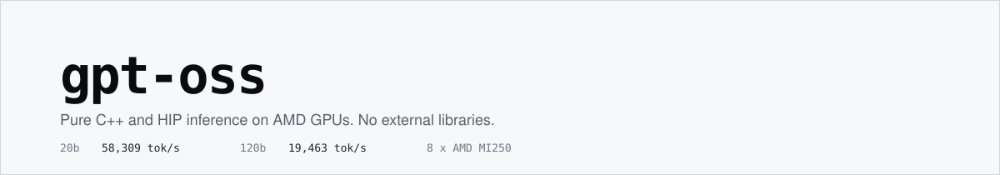

<div align="center">



<p>
  
  
  
  
  
</p>

[Overview](#overview) · [Quick Start](#quick-start) · [Results](#results) · [How It Works](#how-it-works) · [Blog](#blog) · [Docs](docs/) · [License](LICENSE)

</div>

## Overview

OpenAI's `gpt-oss-20b` and `gpt-oss-120b` are already served by llama.cpp, vLLM and SGLang — all of them
built around CUDA and around large dependency stacks. This project takes the opposite approach. It runs
both models on AMD GPUs in **plain C++ and HIP, with no external libraries at all**: no rocBLAS, no
hipBLAS, no RCCL, no MPI. Every kernel, every collective and the tokenizer are written from scratch in
this repository. The only dependency is the HIP runtime itself.

It began from [llama2.c](https://github.com/karpathy/llama2.c) and grew into a complete inference system.
On a single node of 8 AMD MI250 GPUs it serves **69,309 tokens per second on the 20B model and 25,994 on
the 120B model**, while keeping the generated text faithful to a CPU reference.

Two things are measured, and both have to hold:

- **Throughput** — output tokens per second, as high as the hardware allows.
- **Fidelity** — the optimized system must say what an unoptimized CPU implementation would say. Scored
  with METEOR and BERTScore, which must stay above 0.3 and 0.9.

### The models

Both checkpoints share every width; they differ in depth and in how many experts each layer holds.

|                       | `gpt-oss-20b` | `gpt-oss-120b` |
| --------------------- | ------------: | -------------: |
| Transformer layers    |            24 |             36 |
| Experts per layer     |            32 |            128 |
| Experts per token     |             4 |              4 |
| Attention heads       |            64 |             64 |
| Key/value heads (GQA) |             8 |              8 |
| Head dimension        |            64 |             64 |
| Hidden size           |          2880 |           2880 |
| Vocabulary            |       201,088 |        201,088 |

---

## Quick Start

You need an AMD GPU node with ROCm and `hipcc` on your `PATH`, Python 3.10+, and disk for the converted
weights — the exporter writes fp32, so roughly 84 GB for 20B and 467 GB for 120B (the safetensors
downloads themselves are about 13 GB and 65 GB). The build takes well under a minute.

### 1. Clone and set up

```bash
git clone https://github.com/damanhduc140902/gpt-oss.git
cd gpt-oss

python3.10 -m venv .venv
source .venv/bin/activate
pip install -r requirements.txt
```

### 2. Get the weights

Download the `safetensors` and convert them to the flat `.bin` file the C++ loader reads. The conversion
dequantizes the FP4 tensors and flattens everything into one blob.

```bash
python tools/model_export/gpt-oss-20b/export_model_bin.py \
  --input  /path/to/gpt-oss-20b/original/model.safetensors \
  --config tools/model_export/gpt-oss-20b/config.json \
  --output gpt-oss-20b.bin                 # or gpt-oss-120b/
```

| Model          | Hugging Face                                                      | Export script                                                          |
| -------------- | ----------------------------------------------------------------- | ---------------------------------------------------------------------- |
| `gpt-oss-20b`  | [openai/gpt-oss-20b](https://huggingface.co/openai/gpt-oss-20b)   | [`tools/model_export/gpt-oss-20b/`](tools/model_export/gpt-oss-20b/)   |
| `gpt-oss-120b` | [openai/gpt-oss-120b](https://huggingface.co/openai/gpt-oss-120b) | [`tools/model_export/gpt-oss-120b/`](tools/model_export/gpt-oss-120b/) |
| `gpt-oss-7m`   | [tiny-random/gpt-oss](https://huggingface.co/tiny-random/gpt-oss) | [`tools/model_export/gpt-oss-7m/`](tools/model_export/gpt-oss-7m/)     |

The 7M model is randomly initialised and says nothing sensible, but it is two layers wide and loads in a
second — use it to prove the build works before committing to a 65 GB download.

### 3. Build

```bash
./run.sh build          # -O3, the one the benchmarks use
./run.sh build omp      # -O3 with OpenMP and -march=native
./run.sh build debug    # -O0 with symbols
```

`run.sh` wraps the `Makefile`; `make runfast`, `make runomp` and the rest still work. Building also
regenerates `tokenizer.bin` from the `o200k_harmony` encoding.

### 4. Run one prompt

Start here. If this prints an answer, everything is wired up:

```bash
./run.sh run gpt-oss-20b.bin -m generate -i "1+1="
```

Something longer, sampled rather than greedy:

```bash
./run.sh run gpt-oss-20b.bin -m generate -i "Once upon a time" -n 256 -t 0.8 -p 0.95
```

Interactive chat, optionally with a system prompt:

```bash
./run.sh run gpt-oss-20b.bin -m chat
./run.sh run gpt-oss-20b.bin -m chat -y "You are a concise assistant."
```

### 5. Run a batch

`getp` is the batch serving mode, and the one every throughput number on this page comes from.

**It will not take an arbitrary request count.** `inference()` asserts that each model replica's slice
of the file divides evenly into `EXPERT_PARALLELISM × BATCH_SIZE` blocks — 2 × 1536 = 3072 requests for
the 20B model, 8 × 768 = 6144 for the 120B on eight GPUs. The 20B path then pins the total exactly:
`Model_20b::distribute_requests` asserts `requests_per_model == EXPERT_PARALLELISM × BATCH_SIZE`, which
works out to `n_devices × 1536` requests and nothing else — 12,288 on eight GPUs. The 120B path carries
no such assert; `Model_120b::distribute_requests` walks its slice in chunks of
`EXPERT_PARALLELISM × BATCH_SIZE`, so any positive multiple of 6,144 runs, one chunk after another. The
two counts in the [results table](#results) are 12,288 and 6,144. A count that satisfies neither rule
trips an assert in [`src/getp/run.cpp`](src/getp/run.cpp), and **none of the input files shipped in
this repository is the right length**; they declare 32, 256, 448, 3584 and 4096. Build one that fits:

```bash
./run.sh mkinput 20b 8 input_20b.txt        # 12288 requests
./run.sh run gpt-oss-20b.bin -m getp -i input_20b.txt -o out.txt
```

The output file holds token ids, not text. Turn them back into words:

```bash
./run.sh decode -1 -i out.txt               # every completion
./run.sh decode 0 -i out.txt                # just the first
```

Every visible GPU is used automatically — `warm_up` takes the count from `hipGetDeviceCount` and uses
all of it. Eight is the ceiling, though: [`include/transformer.hpp`](include/transformer.hpp) pins `MAXIMUM_GPU` at 8, and the per-device sync state in [`src/hip/forward.hip`](src/hip/forward.hip) — `g_ev_sync` and its `g_ev_sync_ready` flags — is declared `[MAXIMUM_GPU]` and indexed by the absolute device index, before any peer-count check. `warm_up` never clamps the count, so past the eighth device the engine writes off the end of those arrays. To use fewer, regenerate the input for that count — the required size follows
the device count. The count itself has to be even for the 20B model, which pins
`EXPERT_PARALLELISM = 2` and exits during warm-up when the device count is not divisible by it,
however the input was sized:

```bash
./run.sh mkinput 20b 2 input_2gpu.txt       # 3072 requests
HIP_VISIBLE_DEVICES=0,1 ./run.sh run gpt-oss-20b.bin -m getp -i input_2gpu.txt -o out.txt
```

[`tools/make_getp_input.py`](tools/make_getp_input.py) repeats a pool of prompts to reach the required
length; pass `-s your_prompts.txt` to use your own. Repetition is fine for a throughput measurement but
makes the output redundant for quality scoring. The file format is a line giving the request count,
then one prompt per line.

> **The 120B configuration is only set up for 8 GPUs.** `warm_up` sets `EXPERT_PARALLELISM = n_devices`
> for the 120B model, and the dispatch in [`inference()`](src/getp/run.cpp) only routes to
> `Model_120b::distribute_requests` when that equals 8. On any other count it silently falls through to
> the 20B path, and nothing stops it: the only asserts there are request-count checks, which a file from
> `./run.sh mkinput 120b <gpus>` satisfies. The fall-through is harmless in itself — both namespaces run
> the same `getp_forward_120b`, and with `EXPERT_PARALLELISM = n_devices` there is exactly one model
> replica, so the two `distribute_requests` do the same thing for a single chunk. What breaks is memory:
> `warm_up` shards the experts as `n_experts / EXPERT_PARALLELISM`, so fewer devices means more experts
> on each. Four GPUs is 32 experts per device, about 57 GB of expert weights in bf16; add the dense
> weights and the KV cache and it is well past what a 64 GB MI250 device holds, so the run dies on a
> failed `hipMalloc` during warm-up.

### 6. Check the tokenizer

The C++ tokenizer is a reimplementation, so it is worth confirming it agrees with `tiktoken`:

```bash
./run.sh tok "Hello world"          # -> 13225 2375

python3 tests/test_tokenizer.py \
  --bin ./test_tokenizer \
  --tok ./tokenizer.bin \
  --prompts tests/data/input.txt \
  --verbose
```

### 7. Score the output

```bash
./run.sh eval 20b                   # or 120b
```

This decodes `tests/submission/` against `tests/references/` and reports METEOR and BERTScore F1, failing
if either falls under the threshold in [`tests/threshold.json`](tests/threshold.json). A GPU is strongly
recommended; see [`tests/README.md`](tests/README.md).

### All options

```bash
./run.sh --help
```

| Flag | Meaning                                       | Default         |
| ---- | --------------------------------------------- | --------------- |
| `-m` | mode: `generate`, `chat` or `getp`            | `generate`      |
| `-i` | prompt, or input file in `getp` mode          | —               |
| `-o` | output file, `getp` mode only                 | —               |
| `-n` | steps to run; `0` means the full context      | `1024`          |
| `-t` | temperature; `0.0` is greedy and reproducible | `0.0`           |
| `-p` | top-p (nucleus) sampling                      | `0.9`           |
| `-s` | random seed                                   | `time(NULL)`    |
| `-y` | system prompt, `chat` mode only               | —               |
| `-z` | custom tokenizer path                         | `tokenizer.bin` |

---

## Results

Measured on one node of 8× AMD MI250 in batch (`getp`) mode.

| Model          | Requests | Warm-up (s) | Inference (s) | Throughput (TPS) | METEOR | BERTScore |
| -------------- | -------: | ----------: | ------------: | ---------------: | -----: | --------: |
| `gpt-oss-20b`  |    12288 |          23 |           176 |        **69309** |  0.535 |     0.978 |
| `gpt-oss-120b` |     6144 |          31 |           235 |        **25994** |  0.560 |     0.981 |

Where those numbers came from, one optimisation at a time on the 20B model:

|                                                                        | Throughput | Change |
| ---------------------------------------------------------------------- | ---------: | -----: |
| Starting point                                                         |      33979 |      — |
| GEMM tile tuning and per-tile attention softmax                        |      42540 | +25.2% |
| Attention rewritten on `mfma_f32_16x16x16bf16_1k`                      |      50464 | +18.6% |
| LDS tiles stored k-contiguous in all five GEMMs                        |      56434 | +11.8% |
| Per-step allocations, events and a dead 35 MB memset removed           |      57019 |  +1.0% |
| Argmax made independent of block arrival order                         |      57343 |  +0.6% |
| mlp2 block 64 -> 96 with a matching register budget                    |      58309 |  +1.7% |
| Attention scratch LDS reused; five HBM round-trips removed             |      60850 |  +4.4% |
| mlp2 block 96 -> 128 (64-row wave tile), split-K pinned off            |      62937 |  +3.4% |
| MoE host read-backs removed; grids sized from the worst case           |      63444 |  +0.8% |
| Expert exchange made pull-based; two runs now agree on 100 % of output |      62841 |  -1.0% |
| mlp2 k-loop schedule pinned; per-layer queue drains removed            |      64143 |  +2.1% |
| mlp1 k-loop schedule pinned, including the HBM loads                   |      64509 |  +0.6% |
| RoPE folded into the qkv epilogue; router block sized to the expert count; argmax reduced in registers |      65651 |  +1.8% |
| LM head rastered in groups of two row blocks so the weight tile lands in L2 |      66096 |  +0.7% |
| LM head activations converted to bf16 once, which widens the grouping to six |      68424 |  +3.5% |
| q written pre-scaled as bf16, since attention rounded it to bf16 anyway |  **69309** |  +1.3% |

The 120B model reached 20,426 tok/s on that same work without a single change written for it: it runs
the same kernels with the same defaults. Past that point it needed its own work, because its bottleneck
is not the same one:

|                                                                        | Throughput | Change |
| ---------------------------------------------------------------------- | ---------: | -----: |
| Same kernels as the 20B model, no changes specific to the 120B          |      20426 |      — |
| Only the non-zero rows sent in the expert-output exchange               |      22760 | +11.4% |
| The fourteen row-list launches per layer merged into two                |      23136 |  +1.4% |
| Only the rows each peer needs sent in the expert-input exchange         |      23910 |  +3.9% |
| The second sync point on per-peer events instead of a barrier           |      24341 |  +1.8% |
| The expert output emitted one destination slice at a time               |      24685 |  +1.5% |
| The attention-out tile chosen at run time from how full the GPU is      |      24902 |  +0.6% |
| The expert-output exchange sent as bf16 instead of fp32 †               |  **26033** |  +4.5% |

Each percentage is a paired measurement: the two builds run alternately in one session, twice each,
against the same input. Absolute throughput moves about 1 % between sessions, so the rows are not
strictly comparable across the table - the number that stands behind the summary above is the
verification run of the shipped build, which measured 26,088 and 25,900 tok/s with no flags set.

† Every row but the last is bit-exact. The last is not: the expert partial sums now cross the
interconnect as bf16, so the 120B's output changes and it hashes to `18a57667bd03` where it used to
hash to `efe1096ff64c`. It was therefore accepted on its scores rather than its hash - METEOR 0.5608
to 0.5603 and BERTScore 0.9814 to 0.9805, against thresholds of 0.3 and 0.9 - and it is still
reproducible from run to run. It is gated on `EXPERT_PARALLELISM > 2`, so the 20B never takes that
path and still hashes to `720709b86d36`.

At expert parallelism 8 the 120B spent 63% of every step with the GPUs idle, nearly all of it waiting
on the expert exchange. The output half was seven dense 8.85 MB blocks per layer, one per peer,
62 MB in all - but a device only produces output for tokens that routed to one of its own experts,
and with 128 experts and top-4 that is 43% of them, so the other 57% of what it sent was zeros.
Sending only the non-zero rows is exact, and the receiver needs nothing extra to know which rows
are coming: it already holds every slice of the top-k table, so it derives the same set the sender
did.

The input half turned out to be the same shape of waste, and it took a second look to see it. Every
rank was broadcasting all 768 of its rows to all seven peers, 31.0 MB per layer, although a peer
reads a row only if it owns one of that row's experts - the same 42% of rows, by the same
arithmetic. Nothing else reads those rows either: the activations are only ever fetched through the
(token, expert) pair list, so a row nobody owns is never touched. Not sending it is exact. That
turns the broadcast into an all-to-all and takes the input half to 13.2 MB per layer.

What that exposed is that trimming bytes has a ceiling. The 18 MB cut was worth only +3.9%, not the
+6% the byte count predicts, because a rank that finishes its transfer early just waits longer at
the next barrier - the slowest rank still gates everyone. So the last change is not about bytes at
all: the second of the two per-layer sync points now orders the exchange with one event per peer
instead of draining the stream and meeting at a barrier. The old sequence made the GPU wait for a
full round trip through the host - finish, wake the host thread, meet seven other threads, issue
the copies - and that round trip was 1.57 ms per layer, 39% of all idle time. With events the
copies are already queued and start the instant the peer's data is ready.

Two attempts to overlap the transfers instead of shrinking them both lost, and it is worth saying so.
Splitting one copy across 2, 4 and 8 streams on the 20B went 69274 to 68691 to 67750 to 66001; giving
each of the seven peers its own stream on the 120B went 20617 to 12877. The GCDs share one fabric
rather than holding seven independent paths, so the transfer time is set by total bytes and
concurrency only adds contention. Those two negative results are what pointed at the zeros.

Warm-up is dominated by reading the checkpoint off disk, so it depends on whether the file is still in
the page cache; it is not part of what the optimisation work changed.

Throughput is aggregate across all eight GPUs, not single-stream latency. The quality gates are METEOR
0.3 and BERTScore 0.9; both models clear them several times over, so the speed was not bought with
degraded output.

Every figure in that table comes from one run each. The completions committed in
[`tests/submission/`](tests/submission/) are from the starting point of that table, before any of the
optimisations in it, so they are not the ones those scores were computed from — but they can still be
scored without a GPU: `./run.sh eval 20b` reports METEOR 0.533 and BERTScore 0.978 on them, a hair
under the table's METEOR and the same BERTScore.

Repeating a run still moves throughput - by about 1 % between sessions, less within one: the two runs behind the 120B figure came in at 26,088 and 25,900 - but it very rarely moves the completions.
That was not always true: before the expert exchange was made pull-based, a receiver could read a peer's
buffer while it was still being written, so two runs of the _same binary_ at 8 GPUs agreed on only about
50 % to 95 % of output lines, run pair by run pair. With the pull in place the 120B reproduces its hash from run to run, and every optimisation listed above
but one was checked by hashing the output rather than by scoring it - the 20B against 720709b86d36 and
the 120B against efe1096ff64c, both with zero differing lines. The exception is the bf16 return leg,
which changes the 120B's numbers by design; it was judged on METEOR and BERTScore instead, and its
output still hashes identically from one run to the next. A hash is a far sharper instrument than
METEOR when the claim is that a change moved no numbers, and it is what makes a 0.6% win safe to accept.

The 20B is not quite there. Of its last twelve full-length runs on the reference input, eleven hashed
identically; the twelfth differed in 7 of its 12,288 lines, all of them requests served by the same
GPU, and that same binary then gave the usual hash three times in a row. A change that altered the
numbers would do so every time, so this is a rare ordering race still left somewhere on the 20B's
two-device exchange path, and it has not been found yet. The 16-step gate behind 720709b86d36 has never missed;
a single full-length 20B run that disagrees is rerun before it is read as evidence.

---

## How It Works

|                 | What it does                                                                                                                                                                                                                  | Detail                                |
| --------------- | ----------------------------------------------------------------------------------------------------------------------------------------------------------------------------------------------------------------------------- | ------------------------------------- |
| **Model**       | The architecture as this code implements it, the `.bin` weight format and its FP4 dequantization, the `o200k_harmony` tokenizer and the sampling path.                                                                        | [MODEL.md](docs/MODEL.md)             |
| **Kernels**     | A blocktiled GEMM issued entirely on the matrix cores with double buffering, a FlashAttention-style attention kernel that exploits grouped-query attention, and one fused kernel that serves every expert in a single launch. | [KERNELS.md](docs/KERNELS.md)         |
| **Parallelism** | Expert × Data parallelism across the GPUs, with all-gather and reduce-scatter built from peer-to-peer copies alone and ordered so PCIe runs full-duplex.                                                                      | [PARALLELISM.md](docs/PARALLELISM.md) |
| **Serving**     | The `getp` batch runtime: how requests are batched and scheduled, what the warm-up buys, and where the throughput actually comes from.                                                                                        | [SERVING.md](docs/SERVING.md)         |

### Code structure

```plain
gpt-oss/
├── include/            # shared headers
├── src/
│   ├── run.cpp         # entry point, CLI, sampling, chat and generate loops
│   ├── tokenizer.cpp   # o200k_harmony tokenizer
│   ├── decode.cpp      # token ids -> text utility
│   ├── getp/           # batch serving: runtime, scheduling, collectives
│   └── hip/            # HIP kernels: GEMM, attention, MoE, norms
├── tests/              # METEOR / BERTScore evaluation, prompts, references
├── tools/              # weight and tokenizer conversion, getp input generator
├── docs/               # engineering write-up
└── run.sh              # build / run / mkinput / decode / tok / eval wrapper
```

---

## Blog

A write-up of how this was built — what was tried, what was discarded, and where the throughput actually
came from — is on its way. Until it lands, [`docs/`](docs/) carries the same material in shorter form.

---

## Acknowledgments

This project was part of the GPU Engineer Training Program, a collaboration between
[Moreh](https://www.linkedin.com/company/moreh-vietnam/) and
[THUNDER Research Group](http://snuvm.snu.ac.kr/) (Seoul National University). It started from
[llama2.c](https://github.com/karpathy/llama2.c) by Andrej Karpathy.
