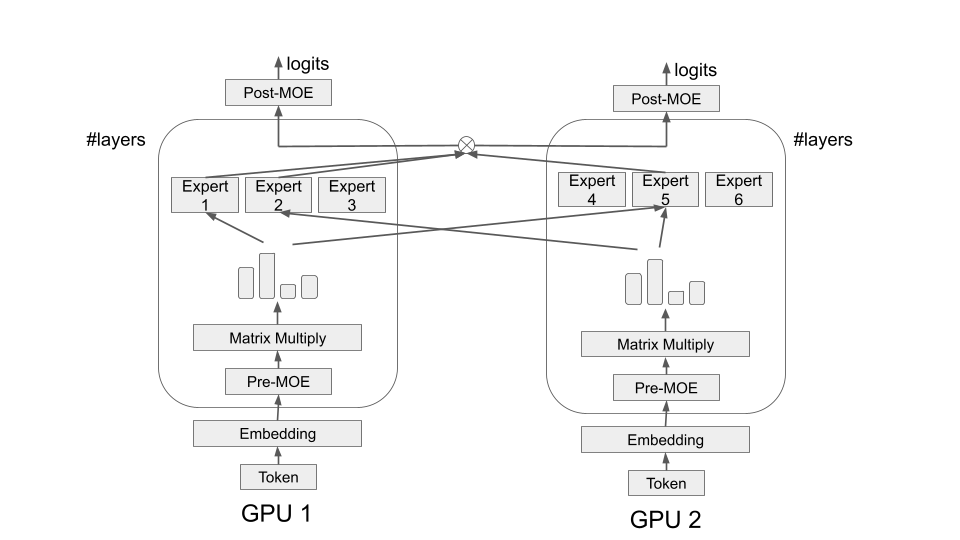
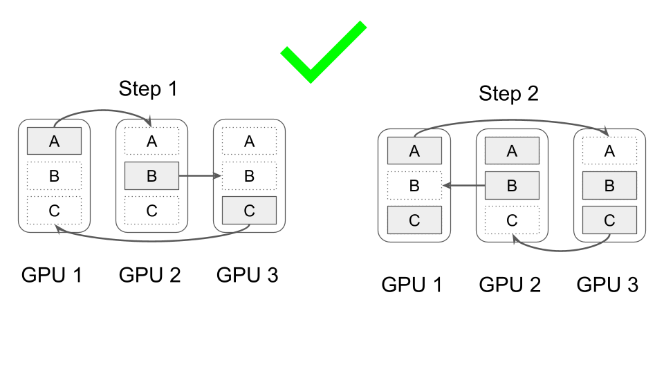
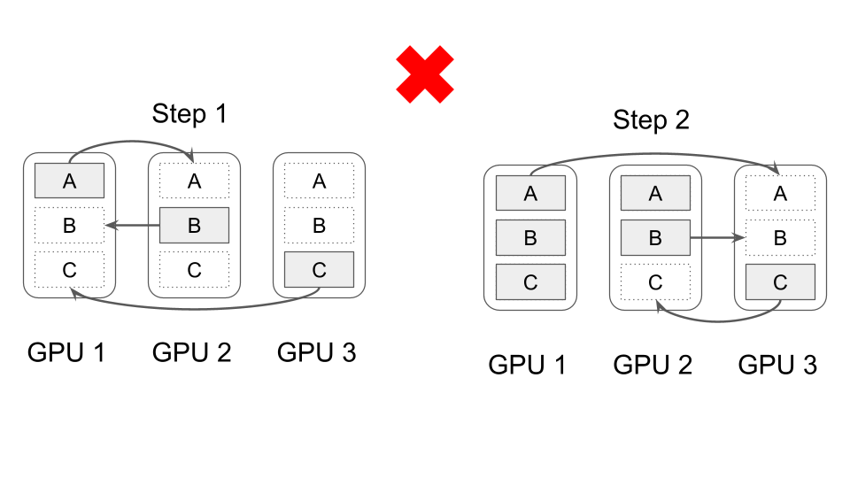

# GPT-OSS on AMD GPUs

## Table of contents

- [Overview](#overview)
  * [Project overview](#project-overview)
  * [GPT-OSS model overview](#gpt-oss-model-overview)
- [Core kernels](#core-kernels)
  * [Matrix multiply kernel](#matrix-multiply-kernel)
  * [Multi-head attention kernel](#multi-head-attention-kernel)
  * [Mixture-of-experts](#mixture-of-experts)
- [Parallelism](#parallelism)
  * [Expert x Data parallelism](#expert-x-data-parallelism)
  * [Communication](#communication)
- [Experiment result](#experiment-result)
- [Acknowledgements](#acknowledgements)

## Overview

### Project overview
This project attempts to launch two OpenAI's open-weight language models: gpt-oss-20b and gpt-oss-120b on a system using only AMD GPUs. The project has been developed based on the [**llama2.c**](https://github.com/karpathy/llama2.c). There are 2 main goals of the project:
* **Throughput**: Achieve the highest possible number of output tokens per second
* **Preserved output tokens**: The output tokens generated by the optimized inference system should have similar meaning to those produced by a simple CPU-only system. Output tokens that preserve the intended meaning are considered correct.
  * The similarity in meaning is evaluated by two metric scores: METEOR and BERT. For this project, the scores must exceed thresholds of 0.3 and 0.9, respectively.

The project attempts to achive the given goals by optimizing the inference system deployed on a computing server system consisting of 8 AMD MI250 GPUs. Consequently, the inference system should be implemented using HIP programming model. 

Eventhough the goal is achieving the highest throughput, there are some restriction rules:
* Only standard C/C++ library is allowed to use, other 3rd-party library is prohibited.
* `hip` and `omp` are the only two exceptions. 

### GPT-OSS model overview

Both gpt-oss-20b and gpt-oss-120b can be visualized as shown in the figure below. For simplicity reason, the residual connections are omitted in the figure. Overall, gpt-oss is a transformer model combining with the mixture-of-experts (MoE) mechanism. The only difference is that gpt-oss-120b model has more layers and greater number of experts per layer than the gpt-oss-20b model.


## Core kernels

Matrix multiplication (including the MLPs in the mixture of experts) and multi-head attention are the two most important layers of the model due to the heavy computational load. Because of the high-throughput objective, these core kernels are implemented with the assumption that the batch size supported by the inference system can be very large (e.g., 512, 1024 prompt tokens at a time).

### Matrix multiply kernel

The kernel should perform the $\text{C}=\text{A}\times\text{B}^{\top}$ matrix multiplication operation, where sizes of the matrices $\text{C}$, $\text{A}$, and $\text{B}$ are respectively $\text{M}\times\text{N}$, $\text{M}\times\text{K}$, and $\text{N}\times\text{K}$. The value of $\text{M}$ mostly equals to the batching size that the inference system operates, while $\text{N}$ and $\text{K}$ are both fixed by the model's architecture and varied in different kinds of layer. For instance, in the 'Matrix Multiply' layer within the 'Mixture of Experts' layer (as shown in the figure above), the values of $\text{N}$ and $\text{K}$ differ significantly from each other, although the value of $\text{M}$ remains the same. 

The most important technique used in the implementation is the blocktiling technique with appropriately chosen tiling parameters. The main goal of this technique is increasing the arithmetic intensity of the kernel to raise its theoritical theoretical peak throughput. The tiling parameters depend on the values of $\text{M}$, $\text{N}$, and $\text{K}$. When the sizes of matrices $\text{A}$, $\text{B}$, and $\text{C}$ are all very large (e.g, more than 1000), the tiling size should also be large (e.g, 128x128). But in the case that $\text{M}$ and $\text{N}$ are small (e.g, 16, 32), the tiling size parameters should be changed to some other appropriate values. 

Another technique used is double-buffering, which hides memory latency when loading data from the high-bandwidth memory (HBM) to the local data share (LDS) within the compute unit. Moreover, the specialized hardware matrix core accelerators are also exploited using the built-in intrinsic functions of the HIP programming model. All computation instructions in the kernel are issued by the matrix cores. 

### Multi-head attention kernel

The implementation of the multi-head attention kernel is based on the FlashAttention algorithm, which computes the softmax operation on the fly. The remaining challenge is how to compute the attention scores effectively. In the mathematical formulation, the attention scores are computed as the dot product between each query head and the corresponding key heads. This computation can be performed in a manner similar to matrix multiplication, and all techniques used in the previous matrix multiply kernel can also be applied here. By exploiting the grouped-query attention (GQA) mechanism in the gpt-oss model, one thread block is assigned to one key/value head instead of query head to increase more available data reusing. The figure below visualizes how the attention score computation is implemented overall. In addition, the key/value cache mechanism is used to avoid recomputing the key/value of previous generated tokens.


### Mixture-of-experts

The MLP layers is executed in the same manner as matrix multiply kernel. To do that, the input for experts are "sorted" so that there is a matrix multiplication for each expert. However, a big problem is that the distribution of inputs across experts is non-uniform. Often, some experts receive a large number of inputs to process, while many others receive few or none. Consequently, if the matrix multiply kernels for the MLP layers in the mixture-of-experts are launched inappropriately, the hardware computing resources may be underutilized. To address the issue, only one specialized kernel is launched once for all experts. 

## Parallelism

### Expert x Data parallelism

To fully leverage the available multi-GPU system, an appropriate parallelism model must be integrated into the inference system. Both the gpt-oss-20B and gpt-oss-120B models use a combination of expert and data parallelism, referred to as Expert × Data parallelism. An illustration of this parallelism is shown in the figure below. Each gpu has its own transformer weights and key/value cache, which are independent of each other. Only the experts are distributed evenly across different devices. The computation of transformer layers can be performed in parallel, whereas mixture-of-experts layers require synchronization between devices.



For gpt-oss-120b model, since the memory footprint of the weight parameters is substantial, the expert parallelism parameter (EP) is set to 8. In other words, experts in the gpt-oss-120b are distributed across all available GPUs in the system. Even though the gpt-oss-20b model can run on a single AMD MI250 with 64 GB of memory, EP is set to 2. This is because expert parallelism helps to reduce the memory footprint of the model weights allowing more space to increase the batch size when running the gpt-oss-20b model.

### Communication

There are two types of collective communication: all-gather and reduce-scatter to be implemented when expert parallelism is used. These are implemented using the peer-to-peer communication (P2P). The send and fetch operations in P2P are built solely with the `hipMemcpyPeerAsync` memory operation. The abstraction of the all-gather and reduce-scatter collective communications is illustrated in the figure below, where the left side shows all-gather and the right side shows reduce-scatter. 


To exploit the full-duplex capability of PCIe, the order of send and fetch instructions executed by each device must be carefully considered. One way to do that for the all-gather collective communication is shown in the figure and the pseudo-code below. The key idea is to ensure that, under ideal conditions, each device is sending to and receiving from only one other device.

```
int i; // index of the device being managed
for (int delta = 1; delta < N_DEVICES; ++delta) {
  int j = (i + delta) % N_DEVICES;
  /*
    Send data to device having index j
  */
}
```



Incorrect ordering of send or fetch operations can prevent full utilization of the PCIe full-duplex capability, as shown in the example below.

```
int i; // index of the device being managed
for (int j = 0; j < N_DEVICES; ++j) {
  if (i != j) {
    /*
      Send data to device having index j
    */
  }
}
```



## Experiment result

| Model          | Num Requests | Warm-up (s) | Throughput (TPS) | METEOR | BERTScore |
| -------------- | ------------ | ----------- | ---------------- | ------ | --------- |
| `gpt-oss-20b`  | 12288        | 180         | 33891            | 0.53   | 0.97      |
| `gpt-oss-120b` | 6144         | 390         | 13010            | 0.56   | 0.98      |


## Acknowledgements

This project was part of the GPU Engineer Training Program, a collaboration between [Moreh](https://www.linkedin.com/company/moreh-vietnam/) and [THUNDER Research Group](http://snuvm.snu.ac.kr/) (Seoul National University).