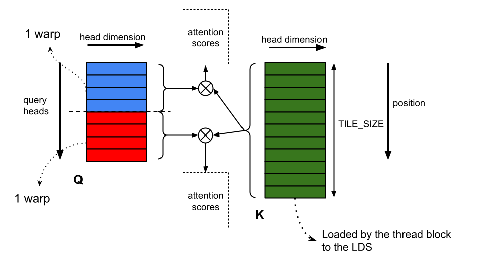

# Core kernels: GEMM, attention, mixture-of-experts

Matrix multiplication, multi-head attention and the mixture-of-experts block are where essentially all
of the time goes, and all three are implemented from scratch in a single file,
[`src/hip/forward.hip`](../src/hip/forward.hip), against the project's constraint of standard C/C++ plus
`hip` and `omp` — no rocBLAS, no hipBLAS. The target is one GCD of an AMD MI250 (`gfx90a`, 64-lane
waves, 104 compute units, 64 KB of LDS per CU), and the workload is a large batch of *requests* decoded
one token at a time: 1536 requests per GPU for `gpt-oss-20b`, 768 for `gpt-oss-120b`
([`src/getp/run.cpp`](../src/getp/run.cpp)). That single fact shapes everything below. The GEMMs see a
tall, thin left-hand operand and can be tuned per call site; attention sees exactly one query token per
request and is therefore bound by memory traffic, not by arithmetic.

## Matrix multiply

Every matrix multiply in the engine computes $\text{C}=\text{A}\times\text{B}^{\top}$, where the sizes
of $\text{C}$, $\text{A}$ and $\text{B}$ are respectively $\text{M}\times\text{N}$,
$\text{M}\times\text{K}$ and $\text{N}\times\text{K}$. $\text{M}$ is mostly the batch size the system
operates at; $\text{N}$ and $\text{K}$ are fixed by the model architecture and vary a great deal between
layers. Storing $\text{B}$ transposed means both operands are K-major, so the reduction axis is
contiguous for both and every global load can be a 16-byte `uint4`.

### Seven GEMMs, one per call site

There is no general-purpose GEMM here. There are seven matrix-multiply kernels, one for each place in
the model where a matrix multiply happens, and each is launched from exactly one site. Shape is fixed at
compile time at every site except the router's, whose launcher inspects $\text{M}$ and $\text{N}$ at
runtime to pick between two kernels.

| Kernel | Role | $\text{M}\times\text{N}\times\text{K}$ at 20b |
| --- | --- | --- |
| `new_matmul_qkv_fused_kernel` | fused Q/K/V projection | 1536 × 5120 × 2880 |
| `matmul_attn_o_bf16_kernel_tuned` | attention output projection | 1536 × 2880 × 4096 |
| `matmul_kernel_nosplit` / `matmul_kernel_splitk_store_tuned` | router | 1536 × 32 × 2880 |
| `mlp1_swiglu_bf16_bucketed_kernel_outbf16_tuned` | expert gate/up + SwiGLU ‡ | M × (2 × 2880) × 2880 |
| `mlp2_partial_bf16_bucketed_splitk_kernel_inbf16_tuned` | expert down projection | M × 2880 × 2880 |
| `matmul_logits_argmax_bf16_kernel_tuned` | unembedding + argmax | 1536 × 201088 × 2880 |

‡ MLP1's $\text{N}$ counts *weight rows*, not output channels. gpt-oss interleaves the gate and up rows,
so the kernel consumes 2 × 2880 rows and writes 2880 SwiGLU outputs per token. Sizes that follow the
output axis — the grid, and the LDS tiling in [The fused expert GEMMs](#the-fused-expert-gemms) — use
2880.

The QKV kernel's $\text{N}=5120$ is $4096+512+512$: one GEMM produces Q, K and V together and the
epilogue fans the result out to three destination tensors, so the activation tile is staged and read
once instead of three times.

```c
if (global_x < q_len) {
  dst = q_out + (size_t)global_y * q_len;
  outIdx = global_x;
} else if (global_x < q_len + k_len) {
  dst = k_out + (size_t)global_y * k_len;
  outIdx = global_x - q_len;
} else {
  dst = v_out + (size_t)global_y * v_len;
  outIdx = global_x - q_len - k_len;
}
```

For the two expert GEMMs, $\text{M}$ is not the batch size but the number of routed rows assigned to one
expert; see [Mixture-of-experts](#mixture-of-experts).

### Tiles

All seven kernels launch 256 threads — four 64-lane waves — per workgroup, and all accumulate in fp32
from bf16 inputs. What varies is the tile. Six of the seven take their tile from `#ifndef`-guarded
`#define`s sitting next to the kernel — `MATMUL_MLP1_*`, `MATMUL_MLP2_*`, `MATMUL_ROUTER_*`,
`MATMUL_ATTN_O_*` and `MATMUL_LOGITS_*` — and those are overridable from the compiler command line. The
values below are the shipped defaults. The QKV kernel is the exception: there is no `MATMUL_QKV_*`
macro anywhere in the file and `-D` cannot move its tile.

| Kernel | BM × BN × BK | Wave tile | BN_AGG | Effective N per workgroup (BNt) | LDS per workgroup |
| --- | --- | --- | --- | --- | --- |
| QKV † | 128 × 128 × 32 | 64 × 64 | 1 | 128 | 16 384 B |
| Attention out | 128 × 128 × 16 | 64 × 64 | 1 | 128 | 8 192 B |
| Logits | 128 × 128 × 16 | 64 × 64 | 1 | 128 | 9 216 B |
| MLP1 (gate/up) | 64 × 64 × 32 | 32 × 32 | 2 | 128 | 22 016 B |
| MLP2 (down) | 64 × 64 × 32 | 32 × 32 | 3 | 192 | 17 408 B |
| Router | 32 × 32 × 32 | 16 × 16 | 4 | 128 | 20 480 B |

† Not tunable. `new_matmul_qkv_fused_kernel` fixes its tile as `constexpr` inside the kernel body
([`src/hip/forward.hip:1301-1306`](../src/hip/forward.hip)) — `BM = 128; BN = 128; BK = 32; WM = 64;
WN = 64;` — so retuning it means editing those six lines and recompiling.

The pattern is the one blocktiling predicts. Where $\text{M}$, $\text{N}$ and $\text{K}$ are all in the
thousands, a 128 × 128 block tile with a 64 × 64 wave tile gives the best ratio of matrix-core work to
LDS traffic. The MoE kernels drop to BM = 64 because $\text{M}$ there is a bucket of routed tokens, not
the whole batch, and a 128-row tile would usually be half empty. The router drops all the way to
32 × 32 × 32 with a 16 × 16 wave tile because its $\text{N}$ is only the expert count — 32 for 20b, 128
for 120b — and a wider tile would mask off most of its own output.

The logits GEMM is the extreme case in the other direction. At $\text{N}=201088$ its grid is
$\lceil 201088/128 \rceil = 1571$ column tiles wide, so occupancy is never in question and the design
question is purely how to avoid writing the result (see [Fused epilogues](#fused-epilogues)).

Depth (BK) is 32 where the K loop is long and the operands are cheap to stage, and 16 for the
attention-out and logits kernels, which trades a shorter K loop per LDS round trip for a smaller LDS
footprint — 8 192 B and 9 216 B against 16 384 B for QKV at the same block tile.

One caution if you retune with `-D`. Five of the seven kernels derive the wave's *column* tile index
from `BM / WM` rather than `BN / WN`, for example `waveIdx % (BM / WM)` in the QKV, router,
attention-out and logits kernels. That is correct only while `BM/WM == BN/WN`, which holds for every
shipped configuration. The `static_assert(WARPS_PER_BLOCK == (BM/WM)*(BN/WN))` in those kernels still
passes for a divergent setting, so it will not catch the mistake. Only MLP1 and MLP2 compute the index
properly, from a named `splitN = BN / WN`.

Two more traps sit in the launchers rather than the kernels. The router's launcher does not read
`MATMUL_ROUTER_*` at all: it re-declares the tile as `constexpr int BM = 32, BN = 32, BK = 32;`
(`forward.hip:2819`) and computes both the grid and the *dynamic* LDS request from those literals, while
`matmul_kernel_nosplit` and `matmul_kernel_splitk_store_tuned` size their `extern __shared__` arrays from
the macros. Overriding `-DMATMUL_ROUTER_BLOCK_ROWS=64` therefore leaves the kernels reading past the end
of a shared-memory block allocated for a 32-row tile. And the QKV launcher declares a tile of its own
that contradicts the kernel it launches:

```c
// forward.hip:1498-1500, inside getp_matmul_qkv_fused_bf16
const int BN = 128;
const int BM = 128;
const int BK = 16;      // the kernel body uses BK = 32
```

Only `BM` and `BN` reach the grid computation, so the stale `BK` is inert today. It is recorded here
because a reader who takes it as the QKV depth will get the LDS arithmetic above wrong by half.

### BN_AGG: widening N without widening the wave

Every kernel except the three 128 × 128 projections carries a second N factor. `GETP_BN_AGG` (default 4)
and the per-kernel `BN_AGG` template argument multiply the workgroup's column extent:
`BNt = BN * BN_AGG`. The block still stages a BM × BK activation tile, but it stages BNt columns of
weight, and each wave keeps `BN_AGG` independent accumulator sets spaced BN apart, rather than covering
the extra columns with more waves or a wider wave tile.

The point is A-fragment reuse. In the router loop, one `av` is read from LDS and fed to four matrix-core
instructions against four different `bv`s:

```c
const unsigned short* sx_ptr = &sx[basek * BM + row];
bf16x4 av = {sx_ptr[0], sx_ptr[BM], sx_ptr[2*BM], sx_ptr[3*BM]};

#pragma unroll
for (int g = 0; g < GETP_BN_AGG; ++g) {
  const unsigned short* sw_ptr = &sw[basek * BNt + c + g * BN];
  bf16x4 bv = {sw_ptr[0], sw_ptr[BNt], sw_ptr[2*BNt], sw_ptr[3*BNt]};

  d_acc[g] = __builtin_amdgcn_mfma_f32_16x16x16bf16_1k(av, bv, d_acc[g], 0, 0, 0);
}
```

For the router this is what rescues an otherwise hopeless shape. At BNt = 128 the entire router output
width fits in one block column for both models (32 ≤ 128, and 128 = 128), so `grid.x` is 1, and the LDS
read of the activation is amortised over four matrix-core instructions instead of one.

MLP1 applies the same idea along a different axis. gpt-oss stores the mlp1 weight interleaved — row
`2c` is the gate row for output column `c`, row `2c+1` the up row — so MLP1 keeps two accumulator banks,
`dg_acc` and `du_acc`, and issues the gate and up instructions back to back from one shared `av`. The
gate/up pair costs one A read, not two.

`GETP_BN_AGG` itself reaches only the router pair; MLP1 and MLP2 pass literal 2 and 3 as template
arguments at their launch sites.

### Matrix cores

Every GEMM issues exactly one matrix-core instruction:

```c
dg_acc[g][im][in] = __builtin_amdgcn_mfma_f32_16x16x16bf16_1k(av, gv_array[in], dg_acc[g][im][in], 0, 0, 0);
du_acc[g][im][in] = __builtin_amdgcn_mfma_f32_16x16x16bf16_1k(av, uv_array[in], du_acc[g][im][in], 0, 0, 0);
```

The `_1k` suffix is the CDNA2 form, taking four bf16 per lane; the benchmark build passes
`--offload-arch=gfx90a` (see [Building these kernels](#building-these-kernels), which is not what a bare
`make` gives you).
Fragment types are a two-VGPR `bf16x4` for A and B and a four-VGPR `f32x4` for C/D. The lane mapping is
the standard one and is visible in the index arithmetic: `xMF = lane & 15` selects the row (A) or column
(B), `yMF = lane >> 4` times four selects the K offset, and the epilogues invert it with
`xD = lane & 15`, `yD = 4 * (lane >> 4)`. The 32 × 32 × 8 shape is not used anywhere, and neither is any
fp16, fp8 or XF32 variant. The only other matrix-core instruction in the file is
`__builtin_amdgcn_mfma_f32_4x4x4bf16_1k`, used by the two attention kernels for $\text{QK}^{\top}$.

Counted per workgroup per block-K tile:

| Kernel | Matrix-core instructions per K-tile | Accumulator VGPRs per lane | Prefetch VGPRs per lane |
| --- | --- | --- | --- |
| MLP1 | 128 (64 gate + 64 up) | 64 | 20 |
| MLP2 | 96 | 48 | 16 |
| Router | 32 | 16 | 16 |
| QKV | 128 (BK = 32, two K steps) | 64 | 16 |
| Attention out | 64 | 64 | 8 |
| Logits | 64 | 64 | 12 |

The claim that all computation instructions are issued by the matrix cores holds inside the K loop. The
epilogues are ordinary VALU work, and that is deliberate — the epilogue is where the fusion lives.

### Fused epilogues

Fusing work into the epilogue removes whole tensors from HBM, which at these shapes matters far more
than the arithmetic does.

- **Logits** never writes a logits row at all. Each 128-row block reduces its 201088-wide slice to a
  (max, index) pair in LDS and commits it with a packed 64-bit atomic. That removes a
  1536 × 201088 × 4 B = 1.23 GB write every step, at the cost of supporting only greedy decoding.
- **MLP1** clamps both branches, applies SwiGLU and writes bf16 directly, so the intermediate never
  exists in fp32 and MLP2 reads it at half the width with no conversion pass in between.
- **MLP2** applies the routing weight, which makes the final MoE gather a plain sum.
- **QKV** fans out to three tensors, as shown above.

Operand precision is handled two ways. The router and logits kernels take fp32 activations and convert
to bf16 during the global-to-LDS store, so the conversion rides along with a load that has to happen
anyway. QKV and attention-out want bf16 already in memory and are preceded by a separate
`tensor_fp32_to_bf16` pass.

### Double buffering, and the register pipeline underneath it

All seven kernels run the same software pipeline. The global loads for tile *k+1* are issued into
`uint4`/`float4` registers at the top of the loop body; the matrix-core instructions for tile *k* run
out of LDS while those loads are in flight; then a barrier, the register-to-LDS store, and a second
barrier. Two `__syncthreads()` per K step, in every one of them. This is what actually overlaps HBM
latency with compute, and it costs only the prefetch registers listed above.

LDS double buffering proper — two staging buffers alternating on `(bk / BK) & 1` — exists only in the
two router kernels, which is why their LDS budget is `2 * BK * (BM + BNt) * 2 B = 20480 B` while the
others allocate a single buffer. The extra buffer buys less than it appears to, because the register
prefetch already covers the HBM latency and the mid-loop barrier is kept regardless.

The MoE kernels pad every LDS row:

```c
// LDS Padding optimization: Add padding to avoid bank conflicts
constexpr int PAD = 8;
constexpr int BM_PAD = BM + PAD;
constexpr int BNt_PAD = BNt + PAD;
```

Eight halves is 16 bytes, exactly four LDS banks. Without the pad, the K-plane stride (64, 128 or 192
halves) is a whole multiple of the 128-byte bank cycle, so every K-plane of the transposed staging
layout lands on the same banks. The 128 × 128 kernels use an unpadded
`__shared__ unsigned short xs[BK][BM]`, and so does the double-buffered router.

Occupancy is steered with `__launch_bounds__`, whose second argument in HIP is the minimum waves per
execution unit, not CUDA's blocks per multiprocessor. `NUM_CTA_MLP1 = 2` asks for two waves per SIMD —
eight per CU, that is two 4-wave workgroups — which is exactly what 22 016 B of LDS permits on a 64 KB
CU. `NUM_CTA_MLP2 = 4` asks for four workgroups, while its 17 408 B caps the CU at three.

### The only runtime decision is split-K

Two launchers make a runtime choice, and both use the same rule: query the CU count (falling back to
104), and if the two-dimensional grid holds fewer than `4 × CU` = 416 workgroups, split the reduction
axis so that the idle CUs get work.

```c
const int target_cta = cu * 4;
int splits = (grid_xy >= target_cta) ? 1 : (target_cta + grid_xy - 1) / grid_xy;
splits = min(8, max(1, splits));
const int max_splits_by_K = max(1, (K + BK - 1) / BK);
splits = min(splits, max_splits_by_K);
```

For the router this always fires at the shipped batch sizes. With `gx = 1`, 20b gives
`gy = ceil(1536/32) = 48` and so `ceil(416/48) = 9`, clamped to 8; 120b gives `gy = 24`, so 18, again
clamped to 8. `matmul_kernel_nosplit` is therefore dead code in both shipped configurations — with
`gx = 1` it takes $\lceil \text{M}/32 \rceil \ge 416$, that is $\text{M} \ge 13281$, to run. The split-K router allocates an
$\text{M} \times \text{N} \times \text{splits}$ fp32 scratch with `hipMallocAsync` and finishes with
`reduce_splitk_with_bias`, which sums the slices and adds the router bias.

MLP2's split-K is a different mechanism despite the shared heuristic: no scratch allocation and no
reduction kernel. Partials go straight into the pre-allocated `z_partial`, zeroed by a `hipMemsetAsync`
when `splits > 1`, the epilogue does an `atomicAdd` into it, and the `blockIdx.z == 0` slice contributes
the bias exactly once. At shipped batch sizes MLP2's grid is 15 column tiles by roughly 96 (20b) or 48
(120b) row tiles — 1440 and 720 workgroups against the 416 threshold — so `splits` stays 1 and the plain
store path runs. Split-K there is a small-batch fallback, and whether it engages depends on routing
rather than on anything static.

One constraint worth recording: both split-K paths compute `kChunk = ceil(K / splits)` without forcing
any alignment, while the loads are 16-byte vectors guarded by `kk + 7 < kEnd`. At the shipped
`splits = 8` over $\text{K}=2880$ this is exact, `kChunk = 360`. At `splits = 7`, `kChunk = 412` would
silently zero-fill four k values at the tail of every chunk and misalign the bf16 weight load by 8
bytes. `splits = 7` needs `grid_xy` in 60..69, which the shipped batch sizes do not produce.

## Multi-head attention

Attention is two near-identical kernels — `flash_attn_decode_even_layer_bf16_matrix_core_kernel` and
`flash_attn_decode_odd_layer_bf16_matrix_core_kernel` — dispatched by `getp_flash_attn_decode_bf16`.
Their names are honest — there is no prefill kernel in this engine — but their comments are not. Both
kernels open with the same line, `/* Ignore sliding window mechanism, only consider odd layer */`
(`forward.hip:2254` and `2509`), and it is true only of the second. The first copy sits at the top of
the even-layer kernel, which is exactly the sliding-window one: it does honour the window, through the
`t_start` described in [Sinks and the alternating window](#sinks-and-the-alternating-window). Trust the
`t_start` expressions, not the header comments.

Prompt tokens are teacher-forced through the ordinary decode step, in
[`src/getp/run.cpp`](../src/getp/run.cpp):

```c
if (pos < nums_prompt_tokens[b]) next[b] = prompts_tokens[b][pos];
```

Every forward pass advances every request in the batch by exactly one position. Prompt processing
differs from generation only in which token is fed back; the GPU-sampled token is discarded while the
prompt lasts. So attention is always a one-query-token problem, which makes it bound by KV traffic
rather than by arithmetic, and the kernel is designed around that.

### Grouped-query attention as a matrix-core enabler

The launch is `dim3 block(128)` with `dim3 grid(n_kv_heads, batch_size)` — one thread block per
(KV head, request), which is 8 × 1536 = 12288 blocks per layer per step for 20b. With `head_dim = 64`,
`n_attn_heads = 64` and `n_kv_heads = 8`, the group size is `kv_mul = 8`, and the block's two 64-lane
waves each own `MFMA_M = 4` query heads: query head `h = kv_h * kv_mul + waveIdx * 4 + Ai`. Two waves of
four rows covers exactly the eight query heads that share the KV head.

The obvious payoff is traffic. The 16 × 64 K tile and V tile staged in LDS are consumed by all eight
query heads, so K and V are fetched from HBM once per group rather than once per query head — an
eightfold reduction on the dominant cost.

The subtler payoff is that GQA is what makes the matrix core usable at all. With one query token per
request, per-query-head attention is a GEMV ($\text{M}=1$) and a matrix core is the wrong instrument.
Grouping eight query heads gives $\text{M}=8$, which is precisely two waves' worth of the four-row
A-operand.



### One instruction per score tile

The instruction is `__builtin_amdgcn_mfma_f32_4x4x4bf16_1k`, used in an unusual way. It computes 16
*independent* 4 × 4 × 4 blocks per wave, and the kernel spends those 16 blocks on the reduction axis
instead of on 16 output tiles. Lane `l` supplies A row `Ai = l % 4` (one of four query heads) and B
column `Bj = l % 4` (one of four keys), with `Ablock = Bblock = l / 4` selecting a four-element slice of
the head dimension. Sixteen blocks of K = 4 covers all 64 head-dim elements, so the loop

```c
for (int dimIdx = 0; dimIdx < HEAD_DIM; dimIdx += MFMA_BLOCK * MFMA_K) {
```

runs exactly once: one instruction produces the partial 4-query by 4-key score tile for the whole head
dimension. The 16 block partials are then folded by a butterfly of `__shfl_down` at widths 32, 16, 8 and
4 — a stride-4 reduction, which is what is needed because lane `bl*4 + j` holds block `bl`, column `j` —
leaving the finished 4 × 4 tile in lanes 0 to 3. `__shfl(acc[i], j)` broadcasts each score back to the
whole wave.

Q never touches LDS. Each lane holds its four bf16 elements in a single two-VGPR register, converted
from fp32 at kernel entry. There is no tiling over the head dimension at all: `head_dim == 64` is
asserted, it equals the wave size, and the whole dot product fits one instruction.

### The online softmax

Rescaling is done per (query head, key) rather than per tile, and the output accumulator is spread
across the wave — `out_values[i]` is a *single float per lane*, with the lane index acting as the
head-dim component.

```c
for (int i = 0; i < MFMA_M; ++i) {
  for (int j = 0; j < MFMA_N; ++j) {
    if (btIdx + t + j >= t_start + n_steps) break;
    float attn_score = __shfl(acc[i], j);
    attn_score *= inv_sqrt_d;
    float m_new = fmaxf(m_values[i], attn_score);
    float alpha = __expf(m_values[i] - m_new);
    float e = __expf(attn_score - m_new);
    l_values[i] = l_values[i] * alpha + e;
    m_values[i] = m_new;

    out_values[i] = alpha * out_values[i] + e * __bfloat162float(vs[t + j][laneIdx]);
  }
}
```

This is FlashAttention with a scalar inner step: a running maximum `m`, a running denominator `l`, and
an output accumulator rescaled by `alpha` whenever the maximum moves. Nothing of size $\text{seq}$ is
ever materialised, which is the whole reason the kernel needs only 4 KB of LDS.

Because V is read as `vs[t + j][laneIdx]`, the PV product is a plain fp32 FMA on the VALU, one per lane
per key — the matrix core handles $\text{QK}^{\top}$ only. Every lane recomputes the identical `m`,
`alpha` and `e`; given this accumulator layout that redundancy is necessary, since each lane must
rescale its own output component. Normalisation is deferred: the division by `l` happens once, in the
epilogue.

Instruction counting says the softmax, not the score product, is the arithmetic bottleneck. Per single
matrix-core instruction, covering four keys, the wave executes 16 cross-lane adds (four widths by four
accumulators), 16 broadcasts and 16 softmax updates carrying 32 `__expf` calls. That is the price of
doing the rescale per key instead of per tile, and it is paid to keep the accumulator in one register
per lane.

Numerically the path is: Q rounded fp32 to bf16 in register, K and V stored bf16 in the cache, scores
accumulated in fp32 inside the matrix core, softmax and PV accumulation in fp32, result written back as
fp32.

One initialiser is worth knowing about before it is discovered by accident. The running maximum is
declared

```c
float m_values[MFMA_M] = {-INFINITY};   // forward.hip:2311, and 2566 in the odd-layer twin
```

which is C aggregate initialisation: element 0 becomes `-INFINITY` and elements 1, 2 and 3 become
`0.0f`. Three of the four query heads in each wave therefore start with a running maximum of zero rather
than −∞. It is harmless as written, because `l_values` starts at 0 and `out_values` at 0: the first real
key gives `alpha = exp(0 - m_new)`, a finite factor applied to accumulators that are still zero, and
after that first update `m` holds a true maximum. Both `l` and `out` pick up the same surplus factor,
which the final division by `l` divides straight back out. It is called out here only so that a
bit-exactness investigation does not start in the wrong place — the pattern reads like a bug, and the
same declaration copied into a kernel that starts from a non-zero accumulator, or that drops the
`l`-rescale, would be one.

### Sinks and the alternating window

gpt-oss adds a learned attention sink per head. It is handled in the epilogue as one extra virtual key
with logit `attn_sinks[h]` and no value — `m`, `alpha` and `l` are updated exactly as for a real key,
and then the accumulated output is divided by `l`:

```c
float attn_score = attn_sinks[h];
float m_new = fmaxf(m_values[i], attn_score);
float alpha = __expf(m_values[i] - m_new);
float e = __expf(attn_score - m_new);
l_values[i] = l_values[i] * alpha + e;
m_values[i] = m_new;
out_values[i] = alpha * out_values[i] / l_values[i];
```

This reproduces the CPU reference, which softmaxes over `pos+2` entries while summing values only over
the real keys.

Sliding-window attention is expressed by *not looking*, rather than by masking. The dispatcher picks the
even-layer kernel when `sliding_window > 0 && (layer_id & 1) == 0`, matching the reference's
`l % 2 == 0` rule. That kernel sets `t_start = MAX(0, pos - sliding_window + 1)` and iterates at most
128 keys; the full-attention kernel sets `t_start = MAX(0, pos + 1 - cache_tcap)`, so even the full
layers are bounded by the ring buffer rather than by `pos`. No additive `-INFINITY` mask is ever
materialised on the GPU. The two kernels differ in exactly three places: the name, the `sliding_window`
parameter, and that `t_start` expression.

### Cache layout and tiling

The KV cache is one bf16 allocation per device, time-major inside each layer: the element address runs
`layer_offset + (t % cache_tcap)`, then batch, then KV head, then head dim. Time capacity differs by
layer class.

| Layer class | Slots (`cache_tcap`) | Why |
| --- | --- | --- |
| Even (sliding) | 128, equal to `sliding_window` | a ring sized to exactly what the layer can see |
| Odd (full) | 1024, equal to `seq_len / 2` | a ring sized to the memory budget |

For 20b that is 12 × 128 + 12 × 1024 = 13 824 time slots per device across 24 layers, at 1.5 MiB per
slot for K and the same for V (1536 requests × 512 elements × 2 B). Note the consequence for the full
layers: they hold half the advertised `seq_len` of 2048, so history beyond 1024 positions is dropped
there too.

Putting time outermost makes the per-step write one contiguous `BATCH_SIZE * kv_dim` block — 1.5 MiB,
perfectly coalesced by `kv_store_pair_fp32_to_bf16`. The cost is on the read side: consecutive timesteps
for one (request, KV head) are 1.5 MiB apart, so each 16-key tile touches 16 separate 128-byte rows. The
trade is deliberate. Writes happen once per step for every request in the batch, while reads are
amortised over the eight query heads of the group.

Sequence tiling is `TILE_T = 16`. LDS is 16 × 64 `unsigned short` for K plus 16 × 64 `__hip_bfloat16`
for V, 4096 bytes per block. K is kept as raw bf16 *bit patterns* so it can be fed straight to the
matrix core; V is stored as `__hip_bfloat16` and converted scalar-wise on use, since it is consumed by
the VALU anyway. With `nbLoadsKV = TILE_T * (HEAD_DIM/8) / BLOCK_SIZE = 1`, each of the 128 threads
issues exactly one 16-byte K load and one V load per tile, the 128 threads covering 16 rows by 8
segments.

Double buffering here is register-staged, not LDS-staged: the next tile is prefetched into `regK` and
`regV` before the compute loop and written into the single LDS buffer after it, bracketed by two
`__syncthreads()`. Register state per lane is small — 12 floats (`out_values`, `m_values`, `l_values`,
four each) plus one Q register — which is what lets a 128-thread block with 4 KB of LDS reach high
occupancy, and occupancy is what hides the KV read latency.

Finished requests cost almost nothing. `if (!mask_on[b]) return;` retires the whole block after a single
global read of the per-request active flag, before any Q, K, V or sink traffic. The flag array is
uploaded each step and cleared when a request emits an end token.

Two limits on generality. The kernel is hard-wired to `head_dim = 64` and `kv_mul = 8`, so the shipped
`gpt-oss-7m` test configuration (head_dim 32, 2 query heads, 1 KV head) would trip the assert. And the
20b/120b split in the dispatch is nominal: `getp_forward_20b` exists but is never called, so both model
sizes run the identical attention path.

## Mixture-of-experts

The MoE block is where a naive implementation loses the most. Routing sends each token to 4 of 32
experts (20b) or 4 of 128 (120b), and the resulting distribution is strongly non-uniform: some experts
receive many tokens, many receive few or none. A kernel launch per expert would leave most of the GPU
idle for most of the block. The approach here is to turn routing into a bucketed row layout once, then
run **one** launch of each expert GEMM across all experts at the same time.

### Routing

Each MoE block starts from the post-attention RMSNorm activation, shape `[B, 2880]`, and scores it
against the router weight with `getp_matmul_router_bf16`. That is an ordinary
$\text{C}=\text{A}\times\text{B}^{\top}$ with $\text{N}$ = expert count and $\text{K}$ = 2880, using the
32 × 32 × 32 tile and `GETP_BN_AGG = 4` described above, with the router bias folded into the epilogue
of the split-K reduction.

Top-k selection is `router_topk_softmax_batch_kernel`: one 1024-thread block per token, scores cached in
LDS, and K sequential selection passes, each a block-wide argmax followed by poisoning the winner with
`scores[topi[sel]] = -INFINITY`. Comparisons use an explicit relative tie-break, and on a near-tie the
*lower* expert index wins:

```c
float thr = eps * fmaxf(fabsf(v), fabsf(best));
if (v > best + thr || (fabsf(v - best) <= thr && i < besti)) {
  best = v;
  besti = i;
}
```

with `eps = 1e-6f`. This matters because the logits come out of a bf16 matmul, where near-exact
collisions are common; the CPU reference sorts with an unstable comparator, so its ties are arbitrary,
and a deterministic rule here is what keeps the GPU path reproducible run to run. Softmax runs *after*
selection and only over the K selected values, matching the reference. `GETP_ROUTER_TOPK_MAXK` (4) sizes
the fixed-length scratch arrays and the shared-memory request; it is a compile-time ceiling on
`experts_per_token`, and all shipped configurations use exactly 4.

### From (token, expert) pairs to buckets

The "sorting" is a counting sort over (token, expert) pairs, and it never moves a routing decision
twice.

| Kernel | Does |
| --- | --- |
| `map_global_to_local_batch_kernel` | filters each token's four global expert ids against `[expert_start, expert_end)`, rebases them to local ids, pads the rest with −1 |
| `moe_count_local_kernel` | histograms the local expert ids |
| `exclusive_scan_small_kernel` | one 256-thread Hillis–Steele scan producing `e_offsets[0..E]` |
| `moe_fill_local_pos_kernel` | re-counts with `atomicAdd` and writes each pair to slot `offsets[lid] + idx` |
| `moe_scatter_acts_to_expert_frombf16_kernel` | physically gathers the activations, one 256-thread block per pair |

The product is three slot-indexed arrays plus one inverse map: `e_dev[pos]` is the token index,
`w_dev[pos]` is that token's routing weight for that expert, and `pair_pos[b*K+k]` is the slot, used
later for the gather (non-local choices get −1). Each expert's input is then a contiguous
`[n_e, 2880]` matrix at `a_in + offsets[e]*H` — precisely what a blocked GEMM wants.

The single-block scan caps experts per device at 256. Both models need 16 — 32 experts at EP = 2, 128 at
EP = 8 — so there is headroom.

### One kernel for all experts

`build_moe_block_schedule` computes `blk_counts[e] = ceil(n_e / 64)` and exclusive-scans it, so
`blk_offsets[E]` is the total number of 64-row tiles over all experts. Both expert GEMMs then launch
exactly once, with `grid.y = total_blocks`. Inside the kernel, each workgroup recovers its own
(expert, tile) pair by binary search:

```c
int by = blockIdx.y;
int lo = 0, hi = E;
while (lo + 1 < hi) { int mid = (lo + hi) >> 1; int off = blk_offs[mid]; if (by < off) hi = mid; else lo = mid; }
int e = lo;
int blk = by - blk_offs[e];
```

Four iterations at 16 experts per device. There is no host-side loop over experts, no launch per expert,
and the grid does not depend on how skewed the routing is. An expert with zero tokens contributes zero
blocks, so `blk_offsets[e] == blk_offsets[e+1]`, and the search — which advances `lo` whenever
`by >= offs[mid]` — maintains `blk_offs[lo] <= by < blk_offs[lo+1]` and therefore can never land on an
empty expert. Load imbalance costs at most one partially filled 64-row tile per non-empty expert,
instead of a serialized launch per expert.

MLP1 and MLP2 share a single schedule because both use BM = 64; the separate MLP2 schedule is commented
out at the call site.

### The fused expert GEMMs

**MLP1** computes gate, up and the activation in one pass. It reads the interleaved weight rows `2*col`
and `2*col+1` directly, keeps the two accumulator banks, issues two matrix-core instructions per
activation fragment, pulls the gate and up biases in a single 32-bit load of the adjacent bf16 pair, and
finishes with:

```c
float gval = fminf(fmaxf(dg_acc[g][im][in][i] + bg_loc[g][in], swiglu_limit_neg), swiglu_limit);
float uval = fminf(fmaxf(du_acc[g][im][in][i] + bu_loc[g][in], swiglu_limit_neg), swiglu_limit);

const float sgm = 1.f / (1.f + __expf(-swiglu_a * gval));
const float out = (gval * sgm) * (uval + 1.f);

output_row[col] = f32_to_bf16bits(out);
```

with `swiglu_a = 1.702f` and `swiglu_limit = 7.0` from the checkpoint configuration. Writing bf16 here
is what lets MLP2 consume the intermediate at half the width with no conversion pass. One deviation from
the CPU reference is worth recording: the reference clamps the gate only from above, while the kernel
clamps it symmetrically. For gate values far below −7 the silu terms differ by at most
|silu(−7)| ≈ 4.7e-5, and after the `(up + 1)` factor the output by at most about 3.7e-4 — negligible,
but real.

**MLP2** is the down projection, and it is where the routing weight is applied: the epilogue scales
every output element by `w_by_bucket[pos]`. That is why the token index is passed to the kernel but
never read in its body, and why the final gather is a pure sum. `moe_gather_pairs_kernel` adds at most
four `z_partial` rows per token through `pair_pos`, skipping −1.

Both expert GEMMs run the K loop 2880 / 32 = 90 times per output tile. Along the output axis MLP1
covers its 2880 channels in $\lceil 2880/128 \rceil = 23$ column tiles — the 2 × 2880 in the GEMM table
above is the weight-row count, not this one — and MLP2 covers its 2880 in exactly 2880 / 192 = 15.

### Costs worth knowing

The design is not free, and the costs concentrate in two places.

**Host synchronization.** Each MoE layer pays three device-to-host reads: `h_off` inside
`build_moe_buckets_local_pos` (which carries its own `TODO: get rid of stream synchronize`),
`total_pairs` before the activation scatter, and `total_blocks` inside `build_moe_block_schedule`. Two
of the three are explicitly blocking. The bucket sizes have to reach the host because the grid extents
depend on them, which is the price of a data-dependent schedule. The first read is currently free to
delete: its only product is `cap_pairs`, the largest bucket size, which is assigned and never read on
any live path.

The second one is not a cost but a hazard, and belongs in a different column. `total_pairs` is copied
with `hipMemcpyAsync` on `compute_stream` (`forward.hip:3734`) and read on the host fifteen lines later
(`forward.hip:3749`) as the grid extent of `moe_scatter_acts_to_expert_frombf16`, with nothing waiting on
that copy in between. It is correct today only by accident of ordering: the `build_moe_block_schedule`
call sitting between the two ends in `hipStreamSynchronize(compute_stream)`, which drains the copy as a
side effect. Move the scatter above that call, or make the block schedule non-blocking, and the scatter
launches with an uninitialised grid size — a silent wrong answer, not a crash. The same pattern without
the accidental rescue is in MLP2's split-K launcher (`forward.hip:1229-1230`), where `total_pairs` is
copied and used on the very next line to size a `hipMemsetAsync`; that branch needs `splits > 1`, which
the shipped batch sizes never produce, which is why it has never bitten. The dead `getp_forward_20b`
uses the blocking `hipMemcpy` at the same place (`forward.hip:3988`) and is, on this one point, the
sounder code.

**Worst-case allocation.** All pair-indexed buffers are sized for
`EXPERT_PARALLELISM × BATCH_SIZE × experts_per_token`, the case where every token routes all four of its
choices to local experts.

| Buffer | 20b (12 288 slots) | 120b (24 576 slots) |
| --- | --- | --- |
| `z_partial` (fp32) | 141.6 MB | 283.1 MB |
| `a_in` (bf16) | 70.8 MB | 141.6 MB |
| `gate_up_bf16` (bf16) | 70.8 MB | 141.6 MB |

Expected live occupancy is roughly 6144 pairs for 20b (16 of 32 experts local) and 3072 for 120b (16 of
128), so most of that is insurance against a routing skew that would otherwise overrun the buckets.

## Building these kernels

Every figure on this page — tiles, LDS budgets, occupancy, and the throughput numbers quoted in
[`SERVING.md`](SERVING.md) — assumes the `runfast` target in the [`Makefile`](../Makefile):

```make
CFLAGS = --std=c++17 -lm $(INCLUDES)     # + --offload-arch=gfx90a, unless CC is g++

runfast: $(CPP_FILES) tokenizer-bin
	$(CC) $(CFLAGS) -O3 -o run $(CPP_FILES)
```

That is what `./run.sh build` selects: its default mode is `fast`. `rundebug` and `runomp` carry the
same `$(CFLAGS)`, at `-g` and at `-O3 -fopenmp -march=native`.

A bare `make` does not. `run` is the default target *and* the only recipe that never expands
`$(CFLAGS)`:

```make
run: $(CPP_FILES) tokenizer-bin
	$(CC) $(INCLUDES) -g -O0 -o run $(CPP_FILES)
```

so it compiles at `-O0`, without `--offload-arch=gfx90a` and without `--std=c++17`. It still produces a
binary — hipcc falls back to its own default architecture — but none of the reasoning above survives it.
The tile choices are argued against a `gfx90a` GCD (64-lane waves, 64 KB of LDS, 104 CUs), the `_1k`
matrix-core form is CDNA2, and `-O0` leaves the register pipeline that the double-buffering section
describes entirely at the compiler's mercy. Build with `runfast`, or with `./run.sh build`, before
measuring anything.

There is no CPU-only build, despite two places in the tooling that suggest otherwise. The Makefile picks
`CC := $(shell command -v hipcc 2>/dev/null || echo g++)`, and `run.sh:81` prints
`warning: hipcc not found, falling back to g++ (CPU only)`. But [`src/run.cpp:1119`](../src/run.cpp)
includes `getp/run.cpp` unconditionally, and [`src/getp/run.cpp:30`](../src/getp/run.cpp) includes
`hip/forward.hip` the same way — there is no `#ifdef` on either. Every `__global__` kernel on this page
is therefore part of the one translation unit that the fallback `g++` would have to compile, and it
cannot. The warning describes a configuration that does not exist; without hipcc the build fails
outright rather than degrading to a CPU path.

## Where to look in the code

| Concept | File |
| --- | --- |
| All GEMM, attention and MoE kernels | [`src/hip/forward.hip`](../src/hip/forward.hip) |
| Tile macros: `MATMUL_*`, `NUM_CTA_*`, `GETP_BN_AGG`, `FLASH_DECODE_TILE_T` (no `MATMUL_QKV_*` exists) | [`src/hip/forward.hip`](../src/hip/forward.hip), defined next to each kernel |
| Batch size, expert parallelism, per-device request slicing | [`src/getp/run.cpp`](../src/getp/run.cpp) |
| KV cache sizing and per-layer ring capacities | [`src/getp/transformer.cpp`](../src/getp/transformer.cpp) |
| MoE scratch buffers: `z_partial`, `a_in`, `gate_up_bf16`, `pair_pos` | [`src/getp/state_ext.cpp`](../src/getp/state_ext.cpp), [`include/state_ext.hpp`](../include/state_ext.hpp) |
| CPU reference for sinks, SwiGLU and top-k | [`src/run.cpp`](../src/run.cpp) |
| Build targets and flags; `runfast` is the one to measure with | [`Makefile`](../Makefile), [`run.sh`](../run.sh) |
| Model dimensions quoted above | [`tools/model_export/`](../tools/model_export/) `config.json` |
| Expert × Data parallelism and the collectives | [`PARALLELISM.md`](PARALLELISM.md) |
