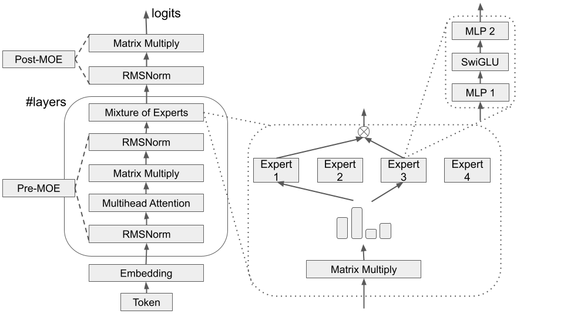

# The gpt-oss model, its weights and its tokenizer

This page describes the model this engine runs: what gpt-oss is architecturally, how the 20B and 120B variants differ, how a Hugging Face checkpoint becomes the flat `.bin` file the C++ loader memory-maps, how `o200k_harmony` is reimplemented in C++, and what "sampling" means in each of the three run modes. It is written from the code in this repository rather than from the model card, so where the implementation deviates from the reference — and it does, in a few places — that is stated. If you are looking for kernels, see [KERNELS.md](KERNELS.md); for the multi-GPU layout, [PARALLELISM.md](PARALLELISM.md).

## Architecture

Both `gpt-oss-20b` and `gpt-oss-120b` can be visualised as shown below. Residual connections are omitted for clarity. gpt-oss is a decoder-only transformer whose dense MLP has been replaced by a mixture of experts.



The two models are the same network with different depth and expert count. That is the single most useful fact about them from an implementation point of view: nothing in the forward pass needs a per-model code path, so one binary serves both. Every shape is read from the checkpoint header at load time.

| Field (`config.json`)    | `Config` member          | 20B      | 120B     |
| ------------------------ | ------------------------ | -------- | -------- |
| `vocab_size`             | `vocab_size`             | 201088   | 201088   |
| `hidden_size`            | `hidden_dim`             | 2880     | 2880     |
| `num_experts`            | `n_experts`              | **32**   | **128**  |
| `experts_per_token`      | `experts_per_token`      | 4        | 4        |
| `intermediate_size`      | `intermediate_dim`       | 2880     | 2880     |
| `num_hidden_layers`      | `n_layers`               | **24**   | **36**   |
| `head_dim`               | `head_dim`               | 64       | 64       |
| `num_attention_heads`    | `n_attn_heads`           | 64       | 64       |
| `num_key_value_heads`    | `n_kv_heads`             | 8        | 8        |
| `max_seq_len`            | `seq_len`                | 2048     | 2048     |
| `initial_context_length` | `initial_context_length` | 4096     | 4096     |
| `rope_theta`             | `rope_theta`             | 150000.0 | 150000.0 |
| `rope_scaling_factor`    | `rope_scaling_factor`    | 32.0     | 32.0     |
| `sliding_window`         | `sliding_window`         | 128      | 128      |
| `swiglu_limit`           | `swiglu_limit`           | 7.0      | 7.0      |

Only `num_experts` and `num_hidden_layers` differ. Note that `max_seq_len = 2048` is a project-set budget, not the real gpt-oss context length; it sizes the KV cache and caps the generation loop.

Three shape facts drive most of the kernel design:

- **The attention block is wider than the residual stream.** 64 query heads × 64 = 4096, but the residual is 2880. So `w_qkv` produces 4096 + 512 + 512 = **5120** outputs per token from a 2880-wide input, and `w_o` contracts 4096 → 2880. Neither is square, and neither matches the MoE shapes.
- **GQA with group size 8.** 64 query heads share 8 KV heads, `kv_mul = n_attn_heads / n_kv_heads`. The KV cache is therefore 8 × 64 = 512 wide per layer, not 4096 — an 8× saving that makes a 1536-sequence batch affordable. It also motivates assigning a thread block to a _KV_ head rather than a query head in the attention kernel.
- **The MoE FFN is not wider than the model.** `intermediate_size` equals `hidden_size`, so a single expert is 2880 → 5760 (gate and up together) → 2880. Capacity comes from having 32 or 128 of them, not from width.

### Attention sinks

Each (layer, head) pair owns one learned scalar in `attn_sinks`, shape `n_layers × n_attn_heads`. It participates in the softmax denominator but has no value vector, so it lets a head attend to "nothing" and emit a near-zero output instead of being forced to distribute its full probability mass over the sequence. The CPU reference does this literally, by appending the scalar to the score array and then only summing values over the real timesteps:

```c
// Add attention sink score
att[pos + 1] = w->attn_sinks[l * p->n_attn_heads + h];
// softmax the scores to get attention weights, from 0..pos inclusively
softmax(att, pos + 2);
```

The HIP kernel cannot materialise the score array — it is a FlashAttention-style streaming softmax — so it folds the same scalar in as one final online-softmax update after the KV loop has finished. That is algebraically identical, and it costs nothing: no extra pass over the cache.

### Alternating sliding-window attention

Even layers are masked to the last `sliding_window = 128` positions; odd layers attend to everything. On the CPU this is `l % 2 == 0` plus an additive mask; on the GPU it is a start bound, `t_start = MAX(0, pos - sliding_window + 1)`, selected per layer by `apply_mask = (sliding_window > 0 && ((layer_id & 1) == 0))` in [`src/hip/forward.hip`](../src/hip/forward.hip).

The win is in memory, not arithmetic. Half the layers only ever need 128 cached timesteps, so the cache is allocated per layer class rather than uniformly — see the KV table below.

### RoPE with YaRN scaling

Rotary embeddings use base 150000 with YaRN: `scaling_factor` 32 over an `initial_context_length` of 4096, the `0.1 * log(s) + 1` attention-concentration factor, and an NTK-by-parts ramp between two cut frequencies. `ntk_beta = 32.0` and `ntk_alpha = 1.0` are _not_ in `config.json`; they are hardcoded at the call sites in both implementations — in `forward` ([`src/run.cpp`](../src/run.cpp)), and in `getp_forward_120b`, which serves both models, as well as in the never-called `getp_forward_20b` ([`src/hip/forward.hip`](../src/hip/forward.hip)). If you ever export a model with different YaRN parameters, the header will not carry them.

The two implementations are line-for-line equivalent, with one difference: the CPU keeps `assert(0 < low && low < high && high < d_half - 1)` as a sanity check on the ramp bounds; the kernel drops it, since an assert per thread block is not worth the register pressure and the bounds are a function of the config, not of the data.

## The mixture-of-experts block

Per token, per layer: RMS-normalise, project to `n_experts` router logits, add the router bias, take the top 4, softmax **over the selected 4 only**, run those 4 experts, and accumulate their outputs weighted by those 4 probabilities. Softmaxing after selection rather than before is what makes the router weights sum to 1 over the chosen experts.

The first expert projection emits gate and up **interleaved on the output axis**, not concatenated. The CPU splits them explicitly:

```c
// Split mlp1_out into gate and up
for (int j = 0; j < p->intermediate_dim; j++) {
  s->gate[j] = s->mlp1_out[2 * j];
  s->up[j] = s->mlp1_out[2 * j + 1];
}
```

The HIP kernel never does that split. It reads weight rows `2*col` and `2*col+1` directly — two separate 16-byte loads, since those rows are `H` = 2880 elements apart, so the _weights_ for one channel are not a single cache line — and it unpacks that channel's two biases from one 32-bit load (`bias_pair & 0xFFFF` and `bias_pair >> 16`). The SwiGLU is then applied in registers before anything is written back. Keeping the file in the interleaved layout the checkpoint already uses therefore saves a full pass over a 5760-wide intermediate.

The non-linearity is gpt-oss's clamped SwiGLU, with `alpha = 1.702` and the two gpt-oss quirks — a clamp at ±`swiglu_limit` (7.0) and the `+1` bias on the up branch:

```c
val *= (1.0f / (1.0f + expf(-alpha * val)));
// elementwise multiply with w_gate(x)
val *= (up_val + 1.0f); // gpt-oss adds an extra bias of 1 to the up layer
```

One deliberate asymmetry to be aware of when comparing outputs: the CPU clamps `gate` only from above (matching the reference `clamp(gate, max=limit)`), while the fused kernel clamps it symmetrically to `[-7, +7]`. The divergence only bites for gate values below −7, where `silu` has already saturated to roughly −4×10⁻⁵, so it is invisible at the metric level; it is called out here only so that a bit-exactness investigation does not start in the wrong place.

The experts dominate the parameter count, and that is the whole reason expert parallelism exists:

|                                      | 20B            | 120B            |
| ------------------------------------ | -------------- | --------------- |
| Parameters as laid out by the loader | 20,914,757,184 | 116,829,156,672 |
| `w_mlp1` + `w_mlp2`                  | 19,110,297,600 | 114,661,785,600 |
| Share of the file                    | **91.4 %**     | **98.1 %**      |

Everything that is not an expert — embedding, unembedding, attention, router, norms — is **1.798 B parameters on the 20B model and 2.128 B on the 120B**. Subtracting the expert biases as well as `w_mlp1` + `w_mlp2`: 20,914,757,184 − 19,116,933,120 and 116,829,156,672 − 114,701,598,720.

The two figures differ because the non-expert share scales with depth, not with expert count. Both models carry the same 1.158 B in the embedding and unembedding matrices — gpt-oss does not tie them, so both 201088 × 2880 copies are stored — and the remainder is 26.6 M per layer of QKV, `w_o`, norms and sinks (26.9 M on the 120B, whose router is 128 rows wide instead of 32), times 24 or 36 layers. Either way it is small enough to replicate on every device, which is exactly what the parallelism strategy does.

## The `.bin` weight format

The checkpoint is a 60-byte header followed by one flat, contiguous, little-endian FP32 blob. The header is `Config` in [`src/run.cpp`](../src/run.cpp): eleven `int`s then four more 4-byte fields (`rope_theta`, `rope_scaling_factor`, `sliding_window`, `swiglu_limit`), so `sizeof(Config)` is exactly 60 and the loader steps past it arithmetically:

```c
float *weights_ptr = *data + sizeof(Config) / sizeof(float);
memory_map_weights(weights, config, weights_ptr);
```

There is no magic number, no version field, no per-tensor metadata and no length check. `memory_map_weights` just walks a pointer forward in a fixed order:

| #   | Tensor                  | Shape (out × in, row-major)   |
| --- | ----------------------- | ----------------------------- |
| 1   | `token_embedding_table` | `vocab_size × hidden_dim`     |
| 2   | `out` (unembedding)     | `vocab_size × hidden_dim`     |
| 3   | `rms_attn_w`            | `L × hidden_dim`              |
| 4   | `rms_ffn_w`             | `L × hidden_dim`              |
| 5   | `rms_out_w`             | `hidden_dim`                  |
| 6   | `w_qkv`                 | `L × 5120 × 2880`             |
| 7   | `b_qkv`                 | `L × 5120`                    |
| 8   | `w_o`                   | `L × 2880 × 4096`             |
| 9   | `b_o`                   | `L × 2880`                    |
| 10  | `attn_sinks`            | `L × 64`                      |
| 11  | `w_router`              | `L × n_experts × 2880`        |
| 12  | `b_router`              | `L × n_experts`               |
| 13  | `w_mlp1`                | `L × n_experts × 5760 × 2880` |
| 14  | `b_mlp1`                | `L × n_experts × 5760`        |
| 15  | `w_mlp2`                | `L × n_experts × 2880 × 2880` |
| 16  | `b_mlp2`                | `L × n_experts × 2880`        |

The file size is read with `ftell`, but it is only used for `mmap`/`munmap` — it is never checked against what the header implies. A header that disagrees with the blob produces silently wrong pointers, not an error. This is the llama2.c bargain, kept on purpose: the format costs nothing to read, the loader is thirty lines, and the producer is a script in this repository rather than a third party. If you hand-edit a `config.json` and re-export, re-export the weights too.

Loading is a `mmap(NULL, file_size, PROT_READ, MAP_PRIVATE, fd, 0)`. Nothing is copied; `TransformerWeights` is pure pointers into the mapping and the CPU forward pass runs directly off page cache.

## The export pipeline

`.safetensors` → `.bin` is [`tools/model_export/`](../tools/model_export/), one script per model size. For 20B:

```bash
python tools/model_export/gpt-oss-20b/export_model_bin.py \
  --input  "${MODELS_ROOT}/gpt-oss-20b/original/model.safetensors" \
  --config tools/model_export/gpt-oss-20b/config.json \
  --output gpt-oss-20b.bin
```

The script writes the 15 header fields with `struct.pack("<i")` / `("<f")` in a fixed `KEYS` order that mirrors `Config`, then streams tensors one at a time. Nothing is ever materialised as a single state dict — for the 120B model that would need half a terabyte of host RAM.

Ordering comes from a `CATEGORIES` list that mirrors the loader one-for-one; every safetensors key is bucketed by suffix (first match wins) and each bucket is sorted by the block index scraped out of `block.<N>.`. Ordering _inside_ `CATEGORIES` is load-bearing: `attn.norm.scale` and `mlp.norm.scale` are listed before the bare `norm.scale` so that per-layer norms win the `endswith` race and only the final norm falls into the bare bucket.

The 120B variant differs only in plumbing: given a directory or an `index.json` it resolves each tensor through `model.safetensors.index.json` and reopens the owning shard per tensor, while still accepting a plain single `.safetensors` input.

### FP4 dequantization

The official checkpoints ship the expert projections in MXFP4, as `X.blocks` / `X.scales` pairs. `collect_effective_keys` detects any such pair and publishes a single synthesized key `X` backed by a lazy loader; `.scales` keys are never published on their own. The rest of the pipeline therefore never learns that a tensor was quantized.

MXFP4 is a shared-exponent format: one **E8M0** scale (an 8-bit power of two, bias 127) per group, and each byte of `blocks` holds two **E2M1** codes — one 4-bit sign-exponent-mantissa value per nibble. Sixteen codes exist, so a lookup table beats any bit-twiddling:

```python
FP4_VALUES = [+0.0, +0.5, +1.0, +1.5, +2.0, +3.0, +4.0, +6.0,
              -0.0, -0.5, -1.0, -1.5, -2.0, -3.0, -4.0, -6.0]
```

The decode itself is four lines, vectorised over a chunk of rows:

```python
idx_lo = (blk & 0x0F).to(torch.long)
idx_hi = (blk >> 4).to(torch.long)
sub[:, 0::2] = lut[idx_lo]
sub[:, 1::2] = lut[idx_hi]
torch.ldexp(sub, exp, out=sub)
```

Three choices are worth explaining:

- **Block geometry is read, not assumed.** `B` comes from `blocks.shape[-1]`, so one scale covers `2B` values — 16 bytes → 32 values for standard MXFP4, but a checkpoint with a different group size still exports correctly.
- **Chunking.** `rows_per_chunk = 16384 * 512` (8,388,608 rows per pass) bounds the peak of the two `int64` index tensors, which are otherwise the largest intermediates.
- **bfloat16 as the intermediate dtype is lossless here.** Every E2M1 value needs at most two explicit mantissa bits, and the scale is a power of two, so `ldexp` cannot introduce rounding: bf16's 8-bit significand represents the product exactly. The later widening to fp32 is exact too. Using fp16 instead would risk overflow on large exponents for no accuracy gain.

### Output dtype and file size

`--dtype` defaults to `float32`, which is what the CPU reference path expects. That has a consequence worth stating plainly before you start an export:

| Model | Parameters      | `--dtype float32`   | `--dtype bfloat16` |
| ----- | --------------- | ------------------- | ------------------ |
| 20B   | 20,914,757,184  | ~83.7 GB (77.9 GiB) | ~41.8 GB           |
| 120B  | 116,829,156,672 | ~467 GB (435 GiB)   | ~234 GB            |

The original MXFP4 checkpoints are roughly **a third** of the bf16 figure, not a sixth, because only the expert projections are quantized. MXFP4 costs 4 bits per value plus one E8M0 scale per 32 values, so 4.25 bits against bf16's 16 — but that 3.76× discount applies to `w_mlp1` + `w_mlp2` alone. The 1.798 B / 2.128 B of non-expert weights, and the expert biases, stay 16-bit:

|                                   | 20B          | 120B         |
| --------------------------------- | ------------ | ------------ |
| `w_mlp1` + `w_mlp2` at 4.25 bits  | 10.15 GB     | 60.91 GB     |
| Everything else at 16 bits        | 3.61 GB      | 4.33 GB      |
| MXFP4 checkpoint, total           | **~13.8 GB** | **~65.2 GB** |
| bf16 export, from the table above | 41.8 GB      | 233.7 GB     |
| Ratio                             | 3.0×         | 3.6×         |

So the export is where the disk goes — a factor of three at `bfloat16`, six to seven if you leave `--dtype` at its `float32` default. With `--dtype bfloat16` the raw 16-bit payload is written via `view(torch.uint16)`, so nothing is silently re-converted.

### One sharp edge

`reorder_keys_for_write` buckets by first matching suffix, and `"unembedding.weight".endswith("embedding.weight")` is `True` while `embedding.weight` is `CATEGORIES[0]`. Both tensors therefore land in the embedding bucket and the `unembedding.weight` bucket is always empty. Both carry `block_idx = -1`, so their relative order is just their order in `all_keys`, which derives from a `set(...)` — and Python randomises string hashing per process. Since gpt-oss does not tie embedding and unembedding, an export can place the two 201088 × 2880 matrices in either order from run to run. If a freshly exported model produces fluent-looking but wrong text, check this first: swap the first two tensors and re-test before debugging anything else.

## From the file to the GPU

The CPU path runs off the mapping directly. The GPU path does not: [`src/getp/transformer.cpp`](../src/getp/transformer.cpp) `upload_weights` converts on the host, one tensor at a time through a pinned staging buffer, and keeps only the norms and the sinks in fp32 — 0.54 MiB for the 20B model. Everything else becomes bf16.

The upload is split into two allocations along the parallelism boundary:

- `dev_linear_bf16` — embedding, unembedding, QKV, output projection, router. Replicated on every device.
- `dev_experts` — only this device's `[expert_start, expert_end)` slice, copied layer by layer so that the expert axis stays contiguous and the MoE kernel can index it with a single stride.

| Per device                      | 20B @ EP=2                | 120B @ EP=8               |
| ------------------------------- | ------------------------- | ------------------------- |
| Replicated (`dev_linear_bf16`)  | 3.35 GiB                  | 3.96 GiB                  |
| Experts (`dev_experts`)         | 17.80 GiB                 | 26.71 GiB                 |
| KV cache time slots (`total_t`) | 13,824 (12×128 + 12×1024) | 20,736 (18×128 + 18×1024) |
| `BATCH_SIZE`                    | 1536                      | 768                       |
| KV cache, K + V in bf16         | 40.5 GiB                  | 30.4 GiB                  |

`total_t` is where the alternating window pays off: windowed layers get 128 slots, full layers get `seq_len / 2 = 1024`, and the cache is addressed as a ring with `pos % cache_tcap`. A uniform 2048 slots per layer would have cost the 20B model roughly 3.5× the cache it actually uses.

The two configurations land at close to the same total because `BATCH_SIZE` is the free variable: it is tuned per model to fill whatever HBM the weights leave, which is why 20B runs 1536 sequences and 120B runs 768. EP=2 for the 20B model is chosen for the same reason — the model fits on one device, but halving the expert footprint buys batch size, and batch size is throughput.

One caveat in the cache sizing: a full-attention layer silently becomes a 1024-position window once `pos` passes 1023, because `t_start = MAX(0, pos + 1 - cache_tcap)`. The default `-n 1024` never reaches that point, but `-n 0` (which snaps `steps` to `seq_len = 2048`) would.

## Tokenizer

The model uses OpenAI's `o200k_harmony` encoding: 201,088 tokens. [`tools/export_tokenizer_bin.py`](../tools/export_tokenizer_bin.py) dumps it from `tiktoken` into `tokenizer.bin`, which the Makefile builds as a dependency of `run`:

```
int32  max_token_length
repeat n_vocab times:
    float32 score
    int32   byte_len
    bytes   token_bytes
```

Normal tokens store their **raw bytes** and a `score` equal to the merge rank. Special tokens store their UTF-8 _name_ (`<|start|>` and friends) and the sentinel score `-1e30`. The single exception is the NUL byte, exported as the literal stand-in `<0x00>` because it cannot travel through a C string.

[`src/tokenizer.cpp`](../src/tokenizer.cpp) sorts the vocabulary once by (bytes, length) and does every lookup by `bsearch`. Two consequences follow from the encoding:

- **A merge can never produce a special token.** `get_merge_rank` rejects any candidate whose score is at or below `-1e29f`, so harmony control tokens are unreachable from text. That matters because `getp` feeds raw prompt lines straight in: no input file can inject a control token.
- **The stored score does no work beyond that sentinel.** `get_merge_rank` returns `(unsigned)id` as the rank, not the score. This is correct only because `tiktoken`'s `mergeable_ranks` maps each byte string to an id that _is_ its rank. It is worth knowing before porting this loader to another encoding.

Pretokenization is the weak point and should be treated as such. `encode_with_simple_splits` implements exactly one rule — runs of digits are chopped into groups of at most three, everything else is a single span — and then runs plain lowest-rank-first BPE over each span, rescanning every merge candidate each iteration (quadratic in span length). The o200k contraction, letter, punctuation and whitespace rules are not implemented. `max_token_length` is load-bearing beyond being a buffer hint: it also caps the byte span a merge may consider.

Agreement with `tiktoken` is therefore established empirically, not by construction, by [`tests/test_tokenizer.py`](../tests/test_tokenizer.py) over a prompt set:

```bash
make tokenizer-test
./test_tokenizer -t tokenizer.bin -i "Hello world"   # 13225 2375
```

One leftover: `Tokenizer::byte_tokens[256]` is populated at load and never read anywhere in the tree. Only `byte_pieces` is used, and only for `<0xHH>` tokens, of which the exporter creates exactly one.

## The harmony template, and what this engine actually sends

The harmony format wraps messages in control tokens. The ids appear in comments at the top of `generate()` and of the `getp` loops:

| Token | id | Used in code? |
| --- | ---: | --- |
| `<\|endoftext\|>` | 199999 | yes — stop token |
| `<\|return\|>` | 200002 | yes — stop token |
| `<\|constrain\|>` | 200003 | no |
| `<\|channel\|>` | 200005 | no |
| `<\|start\|>` | 200006 | inert (see below) |
| `<\|end\|>` | 200007 | no |
| `<\|message\|>` | 200008 | no |

Only the first two are acted on. Both `generate()` and the batch loop retire a sequence when the sampled token is 199999 or 200002. The one other live occurrence, `decode_piece(tokenizer, 200006, token)`, is inert because `decode_piece` discards its `prev_token` argument outright.

So the honest summary is: **no harmony template is rendered anywhere in this repository.**

- `generate` encodes the prompt with BOS and EOS disabled (`encode(..., -1, -1, ...)`), force-feeds prompt tokens while `pos < num_prompt_tokens - 1`, then samples. Raw completion.
- `getp`, the throughput mode that is actually scored, copies each line of the input file verbatim in `read_inputfile` ([`src/getp/eval.cpp`](../src/getp/eval.cpp)) and encodes it the same way. Also raw completion. The per-request input buffer is sized with the tokenizer's `max_token_length` as a bytes-per-token budget: `max_token_len * (max_seq_len + 1)` bytes.
- `chat` has not been ported. It still renders `[INST] ... [/INST]` with a `<<SYS>>` block and watches for token id 2 as end-of-turn — llama2.c's schema. Token 2 is not a control token in `o200k_harmony`, so chat mode will not terminate a turn on its own. Treat it as unmaintained.

Two different length limits apply, which is easy to trip over: prompts are truncated at `initial_context_length` (4096) tokens inside `encode()`, while the generation loop is capped at `seq_len` (2048) and defaults to 1024 steps. The larger of the two is the tokenizer's.

Scoring ([`tests/eval.py`](../tests/eval.py)) compares `tests/submission/output_{20b,120b}_token_ids.txt` against pre-baked references and asserts METEOR ≥ 0.3 and BERTScore F1 ≥ 0.9 (`tests/threshold.json`). Nothing in this repository regenerates those reference files, so the prompt formatting behind them cannot be verified from the tree alone. [`tools/run_transformers.py`](../tools/run_transformers.py) is a standalone Hugging Face demo with a hardcoded path and prompt — useful for a sanity check, not the reference generator, though it does tokenize with `add_special_tokens=False`.

The references are also the wrong _shape_ for the runtime, which is a stronger statement than not being reproducible. Both `tests/references/output_{20b,120b}_token_ids.txt` hold exactly **4096 lines**, one completion each, and so do the two files under `tests/submission/`. But `getp` is particular about how many requests a file holds, and there are two rules, one per model namespace in [`src/getp/run.cpp`](../src/getp/run.cpp). `Model_20b::distribute_requests` asserts `requests_per_model == EXPERT_PARALLELISM * BATCH_SIZE`, which together with `n_parallel_models = n_devices / EXPERT_PARALLELISM` in `inference` pins the 20B total to exactly `n_devices × 1536` — **12288** on eight devices. `Model_120b::distribute_requests` carries no such assert; it walks the file in chunks of `EXPERT_PARALLELISM * BATCH_SIZE`, so its only gate is the divisibility check in `inference`, `(request_end - request_start) % (EXPERT_PARALLELISM * BATCH_SIZE) == 0`, and the 120B total has to be a _multiple_ of `n_devices × 768` — **6144**, 12288, and so on for eight devices. 4096 is neither: it is not 12288, and it is not a multiple of 6144. No input file shipped in the tree declares an accepted number either — they declare 32, 256, 448, 3584 and 4096. So the 4096 references cannot line up one-for-one with any run this binary will accept at its shipped constants.

`eval.py` will not tell you. It aligns by index over `n = min(len(refs), len(subm))`, so a correctly sized 12288-line submission is silently scored on its first 4096 lines against these references, and a threshold met on a third of the output reads exactly like a threshold met on all of it.

## Sampling

### CLI path (`generate`, `chat`)

`sample()` branches on temperature:

```c
if (sampler->temperature == 0.0f) {
  // greedy argmax sampling: take the token with the highest probability
  next = sample_argmax(logits, sampler->vocab_size);
} else {
  ...
}
```

At temperature 0 the raw logits are used — no division, no softmax, no RNG draw. Since **0.0 is the default**, the default run is bit-reproducible for a fixed build (on the 20B, all but a rare full-length run - see the README), and both `-p 0.9` (top-p) and `-s` (seed, otherwise `time(NULL)`) are dead unless `-t` is raised. Above zero it is the llama2.c path unchanged: divide, softmax, then `sample_mult` or `sample_topp`, the latter cropping candidates below `(1 - topp) / (n - 1)` before a `qsort` so the nucleus filter does not sort 201,088 entries.

| Flag             | Default      | Note                                       |
| ---------------- | ------------ | ------------------------------------------ |
| `-t` temperature | 0.0          | 0.0 selects greedy argmax on raw logits    |
| `-p` top-p       | 0.9          | inert at temperature 0                     |
| `-n` steps       | 1024         | 0 or > `seq_len` snaps to `seq_len` = 2048 |
| `-s` seed        | `time(NULL)` | inert at temperature 0                     |

### Throughput path (`getp`)

`getp` is greedy unconditionally. `coop_getp_generate` receives a `Sampler *`, ignores it — the parameter name is commented out and the call site passes `(Sampler *)NULL` — and the next token arrives from `getp_matmul_logits_argmax_bf16`, which **fuses the unembedding GEMM with the argmax**. The 201,088-wide logit row is reduced inside the kernel and never written to memory; `dev_s->logits` is left null. At batch 1536 that avoids materialising and re-reading roughly 1.2 GB of fp32 logits per step, which is the entire point.

The reduction carries a packed `(value, index)` pair in one 64-bit word and merges tiles with a single `atomicMax` on a monotone key:

```c
return (static_cast<unsigned long long>(order_preserving_bits(v)) << 32) |
       static_cast<unsigned long long>(0xffffffffu - idx);
```

The value sits in the high half in an order-preserving bit pattern, the index in the low half complemented so the lower index wins a tie. Unsigned comparison of the packed word is therefore exactly "larger value, then smaller index" — a total order, so no CAS loop and no tolerance are needed. That is `pack_val_idx`, fed to `atomic_update_max_pair`, the **cross-block** merge. It replaced a relative-tolerance predicate that treated two values within 1e-6 relative as tied; that relation is not transitive, so the winner depended on the order blocks arrived in. The router's top-k selection still uses the relative-tolerance form — once in its per-thread scan and once in its shared-memory tree reduction (`router_topk_softmax_batch_kernel`).

The **intra-block** reduction inside `matmul_logits_argmax_bf16_kernel_tuned` looks like the router's rule and is not. It is two passes over the same accumulators:

```c
// pass 1: value only, no epsilon
float mv = atomicMaxFloat(&smax[ly], v);
// pass 2: index, against the finished maximum
float mv = smax[ly];
float thr = 1e-6f * fmaxf(fabsf(v), fabsf(mv));
if (fabsf(v - mv) <= thr) atomicMin(&sidx[ly], gx);
```

The first pass is a plain `atomicMaxFloat` with no tolerance at all, so after the `__syncthreads()` `smax[row]` holds the block's **exact** maximum. Only then does the second pass apply the epsilon, comparing every element against that fixed reference and taking `atomicMin` over the columns that qualify. The reference point does not move, so the smallest column within epsilon of the block maximum wins regardless of the order threads arrive in.

The cross-block merge no longer has a second predicate to compare against. It used to measure against a moving reference — a candidate compared with whatever pair currently occupied the slot, which is not yet the global maximum — and since "within epsilon" is not a transitive relation, the winner depended on the order blocks arrived in, so the same binary could return different tokens on two runs. Packing `(value, −index)` into one monotone 64-bit key removed that: `atomicMax` on the key is a total order, so for a given set of logits the cross-block stage is exact and order-independent, and only the intra-block stage still carries an epsilon. `extract_argmax_pairs` reads back `unpack_idx` and throws the value away.

The surviving intra-block epsilon is deliberately **more tolerant** than the CPU, not stricter: CPU `sample_argmax` uses a plain `>` and so also keeps the lowest index on an _exact_ tie, but it does not treat near-equal logits as tied. The epsilon buys no reproducibility, though: measured against a moving reference it was itself the source of run-to-run flips, which is why the cross-block stage dropped it. It is safe intra-block only because the reference there is already the block's exact maximum.

The genuinely divergent path is on the CPU side: `topk()` sorts router scores with `qsort` and a comparator returning 0 on equality, so expert ordering among equal router scores is unspecified there. Router weights are softmaxed over the selected top-k only, after selection, on both sides.

A standalone `argmax_rows_kernel` exists in [`src/hip/forward.hip`](../src/hip/forward.hip), with a wrapper `getp_argmax_rows`, but neither is ever called; it is the unfused fallback. It uses the running-best relative-tolerance predicate, the same one the router still uses — not the two-pass form, and no longer the same as `atomic_update_max_pair`, which is now a plain `atomicMax` on a monotone key.

## Where to look in the code

| Concept                                                                | File                                                                                         |
| ---------------------------------------------------------------------- | -------------------------------------------------------------------------------------------- |
| `Config` header, `.bin` layout, `mmap` loader                          | [`src/run.cpp`](../src/run.cpp) (`Config`, `memory_map_weights`, `load_checkpoint`)          |
| CPU reference forward pass, attention sinks, MoE, SwiGLU               | [`src/run.cpp`](../src/run.cpp) (`forward`)                                                  |
| YaRN RoPE constants and ramp                                           | [`src/run.cpp`](../src/run.cpp) (`compute_concentration_and_inv_freq`)                       |
| Samplers, `generate`, `chat`, CLI defaults                             | [`src/run.cpp`](../src/run.cpp) (`sample`, `main`)                                           |
| All GPU kernels: attention, MoE, fused logits+argmax, router top-k     | [`src/hip/forward.hip`](../src/hip/forward.hip)                                              |
| fp32 → bf16 upload, expert slicing, KV cache sizing                    | [`src/getp/transformer.cpp`](../src/getp/transformer.cpp)                                    |
| Batch generation loop, `EXPERT_PARALLELISM`, `BATCH_SIZE`, stop tokens | [`src/getp/run.cpp`](../src/getp/run.cpp)                                                    |
| Request I/O and buffer sizing                                          | [`src/getp/eval.cpp`](../src/getp/eval.cpp)                                                  |
| BPE, `bsearch` vocabulary, digit pretokenization                       | [`src/tokenizer.cpp`](../src/tokenizer.cpp)                                                  |
| Token ids → text utility                                               | [`src/decode.cpp`](../src/decode.cpp)                                                        |
| safetensors → `.bin`, FP4 dequantization                               | [`tools/model_export/`](../tools/model_export/)                                              |
| `tiktoken` → `tokenizer.bin`                                           | [`tools/export_tokenizer_bin.py`](../tools/export_tokenizer_bin.py)                          |
| Tokenizer parity test, METEOR/BERTScore thresholds                     | [`tests/test_tokenizer.py`](../tests/test_tokenizer.py), [`tests/eval.py`](../tests/eval.py) |
