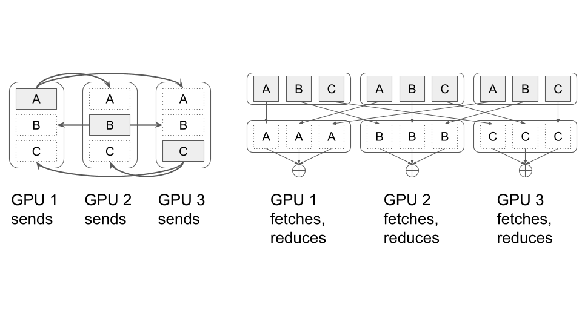

# Expert × Data parallelism and the collectives

Every GPU in this engine holds a full copy of the attention stack and its own KV cache, and only the
MoE experts are split. That is Expert × Data parallelism: attention runs with no coordination at all,
and the expert layer pays for it twice per decoder layer with an all-gather and a reduce-scatter. The
project may not link RCCL or MPI, so both collectives are open-coded from `hipMemcpyPeerAsync` inside
the forward pass in [`src/hip/forward.hip`](../src/hip/forward.hip). This page covers how the split is
chosen, how the two collectives are built, what they cost in bytes, and why the order of the copies
inside each collective is not arbitrary.

## The parallelism model


Each device owns a contiguous window of experts, `[expert_start, expert_end)`, and a contiguous slice
of the global batch. Weights that are not experts — embeddings, attention projections, norms, the
output head — are replicated on every device. `upload_transformer` in
[`src/getp/transformer.cpp`](../src/getp/transformer.cpp) uploads only the device's own expert window,
offsetting `w_mlp1`, `w_mlp2` and their biases by `worker->expert_start`, so the expert weights are
genuinely partitioned rather than replicated and masked.

The consequence is a clean division of labour inside a decoder layer. Attention is data-parallel: the
device sees only its own `BATCH_SIZE` rows and never talks to anyone. The MoE block is expert-parallel:
a token routed to expert 97 must be computed by whichever device owns expert 97, so the activations
have to travel there and the results have to travel back.

The shape is set in `warm_up` in [`src/getp/run.cpp`](../src/getp/run.cpp), from the expert count
rather than from a command-line flag:

```c
if (p->n_experts == 128) {
  // 120b model
  EXPERT_PARALLELISM = n_devices;
  BATCH_SIZE = 768;
}
else {
  // 20b model
  EXPERT_PARALLELISM = 2;
  BATCH_SIZE = 1536;
}
```

|                              | `gpt-oss-20b` | `gpt-oss-120b`  |
| ---------------------------- | ------------- | --------------- |
| Experts in the model         | 32            | 128             |
| Decoder layers               | 24            | 36              |
| `EXPERT_PARALLELISM` (EP)    | 2             | 8 (`n_devices`) |
| `BATCH_SIZE` per device      | 1536          | 768             |
| Experts per device           | 16            | 16              |
| Replicas on an 8-GPU node    | 4             | 1               |
| Tokens in flight per replica | 3072          | 6144            |
| Tokens in flight per node    | 12288         | 6144            |

`hidden_dim` is 2880 and `experts_per_token` is 4 in both models
([`tools/model_export/gpt-oss-20b/config.json`](../tools/model_export/gpt-oss-20b/config.json),
[`tools/model_export/gpt-oss-120b/config.json`](../tools/model_export/gpt-oss-120b/config.json)).

Note the coincidence in the middle of that table: both configurations land on exactly 16 experts per
device. It falls out of 32/2 and 128/8, but it is a useful one — the bucketed MoE kernel described in
[KERNELS.md](KERNELS.md) sees the same number of expert buckets in both models, so it is tuned once.

## Why EP = 2 when 20B's weights fit on one GPU

An MI250 die has 64 GB. `gpt-oss-20b` is 20,914,757,184 parameters as the loader lays them out, and
this engine keeps them resident in bf16 — nothing stays quantised — so the weights are
20,914,757,184 × 2 B = **41.8 GB**. They do fit on a single die, with about 22 GB to spare. (The
13 GB figure that circulates for this model is the size of the original MXFP4 checkpoint on disk, not
of what this engine puts in HBM; see the size table in [MODEL.md](MODEL.md).) So EP = 1 would load,
and it would remove the collectives entirely. It is still not chosen, and there are two reasons, not
one.

The first is capacity, via the KV cache rather than the weights. At `seq_len` 1024 one batch row costs
15.7 MB of cache across the 24 layers, and at 2048 it costs 28.3 MB (the KV table in
[SERVING.md](SERVING.md) derives both). The ~22 GB that EP = 1 leaves free is about 1400 rows at 1024
and about 780 at 2048 — under the 1536 the engine actually runs, and that is before the MoE pair
buffers (`z_partial`, `a_in` and `gate_up_bf16`, ~142 MB at 1536 rows) and the per-row activation
state. The EP staging buffers below are not part of that bill: `ext_alloc_device` skips them
entirely when `expert_parallelism == 1`. EP = 1 is not merely slower at the shipped
`BATCH_SIZE`; it does not fit.

The second is throughput, which is what the freed memory is spent on. EP = 2 halves the expert shard
and takes resident weights from 41.8 GB to 22.7 GB — 3.60 GB dense plus 19.12 GB for 16 of the 32
experts — roughly doubling what is available to the cache, and that is what lets `BATCH_SIZE` be 1536.
Throughput on this workload is dominated by how many rows the GEMMs see: the MoE MLPs are
memory-bound at small M, because each expert weight matrix is read from HBM once regardless of how
many tokens it serves. Doubling the tokens per expert roughly doubles the arithmetic done per byte of
weight fetched. The collectives are the price paid for that, and on 20B they are cheap — a single
peer, 26.6 MB per layer, over 24 layers.

Put plainly: EP = 2 buys headroom and spends it on batch size. Neither reason forces it alone, and the
size of the effect is worth pinning down. At EP = 2 a replica holds 3072 tokens, and with
`experts_per_token` = 4 over 32 experts that is 12288/32 = **384 rows per expert GEMM**. A `BATCH_SIZE`
of 1024 — a round number inside the ~1400 rows that do fit at EP = 1 — gives 4096/32 = **128 rows** — three times thinner, against the
same weight fetch, in exchange for removing the P2P traffic entirely. The repository contains no
measurement of that trade, so read this as the project's judgement rather than as a demonstrated
optimum.

On `gpt-oss-120b` the argument is shorter and admits no trade. 116,829,156,672 parameters in bf16 is
116,829,156,672 × 2 B = **233.7 GB**, so a single 64 GB device cannot hold the weights at any batch
size, and EP = 8 is forced; with the experts split eight ways and the dense weights still replicated,
resident weights come to 32.9 GB per device. The
120B path also drops `BATCH_SIZE` to 768, because the staging buffers are sized
`EP × BATCH_SIZE × hidden_dim` ([`src/getp/state_ext.cpp`](../src/getp/state_ext.cpp)) and so grow
linearly with EP. At EP = 8 that is 6144 tokens in flight per replica with a per-device activation
footprint that stays bounded; at 1536 rows per device the same buffers would be twice the size —
~637 MB instead of the ~319 MB tabulated below, not four times, since only `BATCH_SIZE` changes.

With EP fixed, the node layout follows. `n_parallel_models = n_devices / EXPERT_PARALLELISM`
([`src/getp/run.cpp`](../src/getp/run.cpp)), so an 8-GPU node runs one 8-way replica for 120B and four
independent 2-way replicas for 20B. Replicas never communicate; each gets its own `Barrier` and its own
EP host threads, pinned to cores with `sched_setaffinity`. `inference` dispatches on
`EXPERT_PARALLELISM == 8` to choose the 120B path.

That dispatch is a trap on any node that is not exactly eight GPUs, and it is worth spelling out
because the test is on EP and not on the model. The 120B branch sets `EXPERT_PARALLELISM = n_devices`,
so on a 4-GPU node a 120B run gets EP = 4, fails the `== 8` test at
[`src/getp/run.cpp:524`](../src/getp/run.cpp), and is handled by `Model_20b::distribute_requests` with
the 120B `BATCH_SIZE` of 768 still in force. The two are not interchangeable:

- `Model_120b::distribute_requests` loops over the request list in chunks,
  `for (idx = 0; idx < requests_per_model; idx += EXPERT_PARALLELISM * BATCH_SIZE)`, so it accepts any
  multiple of `EP × BATCH_SIZE` and drains it batch by batch.
- `Model_20b::distribute_requests` has no such loop. It asserts
  `requests_per_model == EXPERT_PARALLELISM * BATCH_SIZE` outright
  ([`src/getp/run.cpp:268-269`](../src/getp/run.cpp)) and runs exactly one batch per replica.

So a 120B run on 4 GPUs does not crash in the kernels — both paths call `getp_forward_120b`, and with
`n_parallel_models = 1` the thread layout comes out the same — but it silently loses the chunking
loop, and the request count stops being "any multiple of `n_devices × 768`" and becomes exactly
`n_devices × 768`. Going the other way is worse: EP above 8 overruns `events_e_agg[MAXIMUM_GPU]`, the
`static thread_local` event array declared at the top of `getp_forward_120b`
([`src/hip/forward.hip`](../src/hip/forward.hip)), which is a fixed array of 8. A 16-GPU node therefore
cannot run 120B at all without changing `MAXIMUM_GPU`.

The request-count rule that follows is the first thing a new reader trips on, so state it directly.
`requests_per_model` is `num_reqs / n_parallel_models`, and for 20B the assert demands it equal
`EP × BATCH_SIZE` = 3072 exactly, with `n_parallel_models = n_devices / 2`. The total request count
must therefore be exactly `n_devices × 1536` — **12288 on an 8-GPU node**, and nothing else. For 120B
on eight GPUs the chunking loop relaxes this to any multiple of `8 × 768` = **6144**, enforced by the
weaker `% (EXPERT_PARALLELISM * BATCH_SIZE) == 0` assert in `inference`; off eight GPUs, as above, it
tightens back to exactly `n_devices × 768`. No input file in the tree satisfies any of these:
`tests/input.txt` declares 4096 requests and the four under `tests/data/` declare 32, 256, 448 and
3584, so pointing `-m getp` at any of them aborts before a single token is generated — on that same
`% (EXPERT_PARALLELISM * BATCH_SIZE) == 0` assert in `inference`
([`src/getp/run.cpp`](../src/getp/run.cpp)), which sits in the worker-layout loop and so runs ahead of
either `distribute_requests`. Build a
correctly-sized file instead — `./run.sh mkinput 20b 8 input_20b.txt` emits the 12288 requests the
8-GPU 20B path demands, and `mkinput 20b 2` the 3072 for a two-GPU run.

## Where the collectives actually live

[`src/getp/collectives.cpp`](../src/getp/collectives.cpp) looks like the answer and is not. It provides
`cgBroadcastF32`, `cgAllReduceSumF32`, `cgReduceSumF32`, `cgAllReduceArgmaxF32I32` and
`cgAllToAllvSlicesF32`, and `warm_up` does build a group for them — `cgCreate(g_world, devices)` — but
nothing in the tree calls any of them. The only internal call is `cgAllReduceSumF32` tail-calling
`cgBroadcastF32`. [`src/hip/forward.hip`](../src/hip/forward.hip) declares
`extern CollectiveGroup g_world;` and never mentions it again. What `cgCreate` contributes to a run is
one non-blocking stream per device, created and later destroyed with no work ever enqueued on it.

The communication the model performs is written inline in `getp_forward_120b`
([`src/hip/forward.hip`](../src/hip/forward.hip)), which is the forward function used by
**both** models — `getp_forward_20b` is still in the same file and is dead, and both `coop_getp_generate`
bodies call the 120B entry point. So the collectives are exactly as advertised in shape — all-gather and
reduce-scatter, built solely from `hipMemcpyPeerAsync` — but they live in the MoE section of the decoder
loop, not behind the `cg*` API.

If you are reading this page in order to modify the communication, ignore `collectives.cpp` and go to
the MoE block of `getp_forward_120b`.



## Phase one: the all-gather

The all-gather publishes what the router decided. Every rank needs the activations and top-k decisions
for the _entire_ EP-wide batch, because any of those `EP × BATCH_SIZE` tokens may have chosen an expert
this rank owns.

The staging buffers `ext_t`, `ext_t_bf16`, `ext_topk_i/v`, `ext_e_agg` and `peer_e_agg` are all sized
`EP × BATCH_SIZE × …` in [`src/getp/state_ext.cpp`](../src/getp/state_ext.cpp). Into `ext_t`,
`ext_t_bf16` and `ext_topk_i/v` each rank writes its own slice, indexed by
`(device_index - base_device_index)` — the forward function calls that index `own_slice`. `ext_e_agg`
runs the other way round: a rank fills every slice of it _except_ its own, for the reason given under
phase two. `peer_e_agg` is indexed by fetch order `j`, not by slice.

The FFN RMSNorm writes its own slice twice in a single pass on the compute stream — fp32 into `ext_t`
for the router, bf16 into `ext_t_bf16` for the wire. The rank then records `event_rmsnorm` on the
compute stream — `event_rmsnorm` and `event_router_topk` are still recorded there, but nothing waits on
them any more. The exchange is ordered by the per-layer barrier instead, and it runs in the opposite
direction: after the barrier each rank *pulls* every peer's bf16 slice, together with that peer's top-k
ids and weights, into the identical offset of its own buffers:

```c
for (int delta = 1, j = 0; delta < EXPERT_PARALLELISM; ++delta) {
  int i = (device_index + delta) % EXPERT_PARALLELISM;
  GPUWorker *peer_worker = &workers[i];
  int peer_device_index = peer_worker->device_index;
  RunStateExt *peer_ext = ext_get(peer_device_index);
  if (peer_device_index == device_index) continue;
  const size_t ps = (size_t)(peer_device_index - base_device_index);
  HIP_CHECK(hipMemcpyPeerAsync(
      ext->ext_t_bf16 + ps * BATCH_SIZE * hidden_dim, device_index,
      peer_ext->ext_t_bf16 + ps * BATCH_SIZE * hidden_dim, peer_device_index,
      sizeof(__hip_bfloat16) * (size_t)BATCH_SIZE * (size_t)hidden_dim, memory_stream));
  // ext_topk_i and ext_topk_v are pulled in the same iteration, same shape.
  HIP_CHECK(hipEventRecord(events_pull[j], memory_stream));
  ++j;
}
```

The expert ids and their weights therefore ride in this one loop rather than a second one. Those are
small, 4 values per token, but they must arrive before the receiving rank can decide which tokens are
its business, so a second loop over the same peers makes the compute stream wait on each
`events_pull[j]` before `getp_map_global_to_local_batch` runs.

The direction was a push before, and the push was wrong. Copying into the peer's buffer on the peer's
memory stream and then synchronising on the host left a rare window in which a rank read the previous
step's `ext_t_bf16`/top-k: hashing 11 points per layer across two 8-GPU runs caught about four events
per run, always on a matching (step, layer) pair of EP ranks, with the first divergence at `a_in` after
the scatter while that rank's own top-k and attention still matched. Acquiring on the receiving side
and fine-grained memory both failed to close it. Pulling on the receiving device's queue is the pattern
the `e_agg` path already used, and it measures clean.
The activations go on the wire as **bf16**, not fp32. Because the RMSNorm above emits both forms in
one pass — fp32 into `ext_t`, which only the router reads, and bf16 into `ext_t_bf16`, which is what
travels — halving the outbound wire cost needs no separate cast kernel and no extra HBM round trip,
at no accuracy the MoE MLPs would notice: they consume bf16 anyway.

Once the gather completes, `getp_map_global_to_local_batch` filters all `EP × BATCH_SIZE` tokens down to
the ones this rank can serve, keeping `eg >= expert_start && eg < expert_end` and rebasing the id to
`eg - expert_start`. One bucketed MLP then runs over whatever survived.

## Phase two: the reduce-scatter

The return path is a **fetch**, the same shape as phase one: a rank reads from its peers rather than writing to them.

`moe_gather_pairs_acc` sums each token's expert pairs once and splits the result by destination. For
the `BATCH_SIZE` tokens of its own slice it adds straight into the residual `dev_x`, which saves a
`getp_vecadd`; for the other `(EP−1) × BATCH_SIZE` tokens it _overwrites_ `ext_e_agg`
(`e_agg[...] = s`, not `+=`). With `GETP_ROWSKIP=0` the B × H grid covers every cell exactly once;
with it on — the default whenever EP > 2, hence on 120B — the kernel returns early for the rows whose
partial sum is zero and packs the survivors to the head of each peer's slice, which is what lets the
fetch be shortened to those rows (see **What it costs**). Every rank therefore
holds a partial sum for every token it does _not_ own — partial, because it only ran the experts it
owns — while its own slice of `ext_e_agg`, which no peer ever reads, is never written at all. Having
folded its own slice into the residual, the rank pulls from each peer the part of that peer's
`ext_e_agg` belonging to _its own_ slice:

```c
for (int delta = 1, j = 0; delta < EXPERT_PARALLELISM; ++delta) {
  int i = (device_index + delta) % EXPERT_PARALLELISM;
  GPUWorker *peer_worker = &workers[i];
  int peer_device_index = peer_worker->device_index;
  RunStateExt *peer_ext = ext_get(peer_device_index);
  if (peer_device_index != device_index) {
    HIP_CHECK(hipMemcpyPeerAsync(
        ext->peer_e_agg + (size_t)j * BATCH_SIZE * hidden_dim, device_index,
        peer_ext->ext_e_agg + (size_t)(device_index - base_device_index) * BATCH_SIZE * hidden_dim,
        peer_device_index,
        sizeof(float) * BATCH_SIZE * hidden_dim, memory_stream));
    HIP_CHECK(hipEventRecord(events_e_agg[j], memory_stream));
    ++j;
  }
}
```

Summed over ranks, scattered over token slices: reduce-scatter.

The inbound partial sums stay **fp32**. They are sums of expert outputs that will be added into the
residual, and rounding each peer's partial to bf16 before summing would accumulate error across up to
eight contributions. The bandwidth cost is accepted instead. Per token slice the return path therefore
Per token slice the return path would therefore move twice the bytes of the forward path — 8.44 MiB against 4.22 MiB per peer on 120B — were every row sent. `GETP_ROWSKIP` (default on, and active here because 120B runs `EXPERT_PARALLELISM` 8) pulls only the rows that are non-zero, and on 120B 57 % of them are zero, so the fetch is about 3.6 MiB per peer — below the 4.22 MiB outbound.

The adds are overlapped with the transfers rather than waiting for all of them:

```c
for (int delta = 1, j = 0; delta < EXPERT_PARALLELISM; ++delta) {
  int i = (device_index + delta) % EXPERT_PARALLELISM;
  GPUWorker *peer_worker = &workers[i];
  int peer_device_index = peer_worker->device_index;
  if (peer_device_index != device_index) {
    HIP_CHECK(hipStreamWaitEvent(compute_stream, events_e_agg[j]));
    getp_vecadd(dev_x,
                ext->peer_e_agg + (size_t)j * BATCH_SIZE * hidden_dim,
                hidden_dim, BATCH_SIZE, compute_stream);
    ++j;
  }
}
```

Each fetch records its own event; the compute stream waits on event _j_ immediately before the _j_-th
`getp_vecadd`. The first peer's contribution is being added while the later transfers — in order on the
same memory stream — are still in flight. That is why this phase does not end with a
`hipStreamSynchronize` on the memory stream. Phase one does not either: it hands its pulls to the compute stream through `events_pull` the same way.

## Ordering: the delta rotation

All five loops in the MoE block walk the same rotation. Two of them copy — the phase-one pull, whose single body carries `ext_t_bf16` and both top-k arrays, and the `ext_e_agg` fetch. The other three issue no transfer at all: two reuse the walk to pair each `hipStreamWaitEvent` with the work that follows it — the waits on `events_pull`, and the waits that gate each add on the return path — and the third, present only when `GETP_ROWSKIP` is active (`EXPERT_PARALLELISM > 2`), launches the receive-side row-list build once per peer slice:
push, the top-k push and the `ext_e_agg` fetch; the fourth issues no transfer at all and only
reuses the same walk to pair each `hipStreamWaitEvent` with its `getp_vecadd`:

```c
int i; // index of the device being managed
for (int delta = 1; delta < N_DEVICES; ++delta) {
  int j = (i + delta) % N_DEVICES;
  /*
    Send data to device having index j
  */
}
```


The copies of one phase are all issued on the same per-device `memory_stream`, created with
`hipStreamNonBlocking` in [`src/getp/transformer.cpp`](../src/getp/transformer.cpp), so they execute in
issue order. That is what makes the ordering meaningful rather than cosmetic.

At step `delta`, rank _i_ is pulling from rank _(i+delta) mod N_ while being pulled from by rank
_(i−delta) mod N_. One outbound and one inbound transfer per rank: a perfect matching on the peer graph
at every step, so every link carries traffic in both directions at once. PCIe is full duplex, and this
is the pattern that uses both halves of it.

The obvious loop does not:

```c
int i; // index of the device being managed
for (int j = 0; j < N_DEVICES; ++j) {
  if (i != j) {
    /*
      Send data to device having index j
    */
  }
}
```


Here every rank targets device 0 at step 0, then device 1, and so on. One node's inbound link takes
N−1 transfers while its own outbound link sits idle. The phase stretches to roughly N−1 serialized
transfers instead of N−1 concurrent ones. On 120B that is the difference between 7 rounds and something
closer to 7 × 7.

Both copy loops read the same way — rank _i_ reads _from_ _(i+delta)_ — and the matching
argument is unchanged: at each step every rank is the source for exactly one peer and the destination of
exactly one transfer.

This rationale is the project's own reasoning. The source contains no A/B measurement of the two
orderings, so read the figures as an argument about link occupancy, not as reported numbers.

One indexing subtlety is worth recording, because it is easy to break. `workers[i]` is indexed with the
_group-relative_ index while `device_index` is absolute. This is only correct because `warm_up` lays
groups out at multiples of EP, and `distribute_requests` passes the forward function the replica base
pointer `workers + EXPERT_PARALLELISM * model_idx`, so `base_device_index` is a multiple of EP and
`device_index ≡ local_rank (mod EP)`. For 20B, replica 1 owns devices 2 and 3, and `(2+1)%2 = 1`
resolves to `workers[1]`, which is device 3. Break that alignment and the rotation silently targets the
wrong peer.

## What it costs

Per device, per decoder layer, with `hidden_dim` = 2880 and `experts_per_token` = 4.

**`gpt-oss-120b`** — EP = 8, `BATCH_SIZE` = 768, 7 peers:

| Direction           | Buffer                      | Type         | Bytes per peer | Bytes per layer |
| ------------------- | --------------------------- | ------------ | -------------: | --------------: |
| Out (all-gather)    | `ext_t_bf16` slice          | bf16         |      4,423,680 |      30,965,760 |
| Out (all-gather)    | `ext_topk_i` + `ext_topk_v` | int32 + fp32 |         24,576 |         172,032 |
| In (reduce-scatter) | `ext_e_agg` slice           | fp32         |      8,847,360 |      61,931,520 |
| **Total**           |                             |              |                |  **93,069,312** |

The reduce-scatter row is the one that is mostly zeros, and `GETP_ROWSKIP` stops sending them. A rank
can only have produced output for a token that routed to one of _its_ experts, and with 128 experts and
`experts_per_token` = 4 the chance a given token missed all 16 of a rank's experts is
C(112,4)/C(128,4) = 0.582. Counted on the real routing it is 55-61 %, mean 57 %. So of the 61,931,520
bytes above, about 35 million carry nothing but zeros, and adding zero is exactly what it sounds like:

| In (reduce-scatter), non-zero rows only | fp32 | ~3,800,000 | ~26,600,000 |

That is 93 MB per layer down to about 58 MB, and it measured 20,426 to 22,760 tok/s, +11.4 %, with the
output hash unchanged. The receiver is not told how many rows are coming. After phase one it holds
every slice of `ext_topk_i`, and expert ownership is the contiguous range `[expert_start, expert_end)`,
so it derives the same row set the sender derived — the sender from its own `n_local`, the receiver
from the top-k and the sender's range. `hipMemcpyPeerAsync` does still need the byte count on the host,
which would normally force a stream sync; at EP > 2 it does not, because `sync_workers_dev` takes the
`n_dev > 2` branch and has already called `hipStreamSynchronize`. Reading 32 bytes back at that exact
point is free. That is also why the whole path disables itself at EP = 2, where the sync point uses
events instead and a blocking copy would cost the overlap — and the 20B would gain nothing from it in
any case, since only 3 % of its rows are zero.

**`gpt-oss-20b`** — EP = 2, `BATCH_SIZE` = 1536, 1 peer:

| Direction           | Buffer                      | Type         | Bytes per layer |
| ------------------- | --------------------------- | ------------ | --------------: |
| Out (all-gather)    | `ext_t_bf16` slice          | bf16         |       8,847,360 |
| Out (all-gather)    | `ext_topk_i` + `ext_topk_v` | int32 + fp32 |          49,152 |
| In (reduce-scatter) | `ext_e_agg` slice           | fp32         |      17,694,720 |
| **Total**           |                             |              |  **26,591,232** |

Over a full decode step:

|                                                             | `gpt-oss-20b` | `gpt-oss-120b` |
| ----------------------------------------------------------- | ------------: | -------------: |
| Layers                                                      |            24 |             36 |
| P2P bytes per device per decode step                        |      ≈ 638 MB |      ≈ 2.08 GB |
| `hipMemcpyPeerAsync` calls per device per layer, 4 × (EP−1) |             4 |             28 |
| Global barriers per decode step, 2 per layer + 1            |            49 |             73 |

Counting the whole phase, which direction dominates depends on `GETP_ROWSKIP`. With it on — the default, and active at EP 8, so this is the shipping configuration for 120B — inbound is the smaller side: about 26,600,000 B in against 31,137,792 B out per layer, because only the reduce-scatter is row-skipped and the all-gather still sends every row. With `GETP_ROWSKIP=0`, inbound is 61,931,520 B, a shade under twice outbound rather than exactly twice, because the outbound side also carries the two top-k arrays.
outbound side also carries the two top-k arrays: 61,931,520 B in against 31,137,792 B out per layer on
120B.

These numbers are the argument for both the delta rotation and sending bf16 on the wire. 3.35 GB of
P2P traffic per device per token step is not something to leave half-duplex.

Staging memory is the other cost. Every EP buffer is sized `EP × BATCH_SIZE × hidden_dim`, so on 120B:

| Buffer       | Type |         Size |
| ------------ | ---- | -----------: |
| `ext_t`      | fp32 |      70.8 MB |
| `ext_t_bf16` | bf16 |      35.4 MB |
| `ext_e_agg`  | fp32 |      70.8 MB |
| `peer_e_agg` | fp32 |      70.8 MB |
| `ext_e_agg`  | fp32 |      70.8 MB |
| `ext_e_agg2` | fp32 |      70.8 MB |
| `peer_e_agg` | fp32 |      70.8 MB |
| **Total**    |      | **≈ 319 MB** |

`ext_e_agg2` is the second half of the layer-parity double buffer (`src/hip/forward.hip:5606`), so it is resident for the whole run and has to be counted.

`peer_e_agg` is over-allocated: it gets EP slots and only ever uses EP−1, so about 8.8 MB of its 70.8 MB
is never touched on 120B.

## Synchronisation and completion

Completion is signalled on the host, not with device-side flags. There are two barriers per layer.

Phase one *begins* with the barrier rather than ending with one. Before any peer copy is issued, every rank
waits at the phase-one sync point, so each has finished writing its own `ext_t_bf16` and top-k slice before
anyone reads them:

```c
#if GETP_DEVSYNC
    sync_workers_dev(compute_stream, memory_stream, sync_point, device_index,
                     EXPERT_PARALLELISM, base_device_index, 2 * (int)l + 0);
#else
    sync_workers(compute_stream, sync_point);
#endif
```

`GETP_DEVSYNC` defaults to 1. At `EP > 2` — the 120B case — `sync_workers_dev` falls through to the same
thing `sync_workers` does, `hipStreamSynchronize` on the stream it was handed plus a host barrier:

```c
inline void sync_workers(hipStream_t stream, Barrier &sync_point) {
  HIP_CHECK(hipStreamSynchronize(stream));
  sync_point.wait();
}
```

At `EP <= 2` — the 20B case — it instead records an event on `compute_stream`, takes the host barrier, and
has each peer `hipStreamWaitEvent` on it, so the host never blocks on the stream at all. The measurement
behind that split is in the comment above `sync_workers_dev`: the event path is 0.7 % faster at EP = 2 and
15 % slower at EP = 8, where seven `hipStreamWaitEvent`s per sync point pile onto `memory_stream`.

Only after the barrier does each rank *pull* its peers' slices — the copies read the peer's buffer and write
the rank's own, on the rank's `memory_stream`, one `events_pull[j]` recorded per peer — and the compute
stream is then gated on those events with `hipStreamWaitEvent(compute_stream, events_pull[j], 0)`. The
sender never blocks on its own transfers, because it never sends: there is no `hipStreamSynchronize` on
`memory_stream` anywhere in the layer loop. Both `sync_workers` and `sync_workers_dev` sync `compute_stream`.

Pull replaced push here for correctness, not speed. Pushing into the peer's buffer on the peer's
`memory_stream` and then taking a host barrier left a rare window in which a rank read the previous layer's
`ext_t_bf16`/top-k: hashing 11 checkpoints per layer across two 8-GPU runs caught about four events per run,
always in matched EP pairs of (step, layer), with the first divergence at `a_in` after the scatter while the
rank's own top-k and attention still matched. Neither a receiver-side acquire nor fine-grained memory fixed
it. Pulling on the receiving device's queue plus an event is the pattern the `e_agg` leg already used, and it
hashes clean.
landed — followed by `sync_workers`:

```c
inline void sync_workers(hipStream_t stream, Barrier &sync_point) {
  HIP_CHECK(hipStreamSynchronize(stream));
  sync_point.wait();
}
```

`Barrier` in [`include/barrier.hpp`](../include/barrier.hpp) is a two-phase atomic counter with
`std::this_thread::yield()` in the spin loop, across the EP host threads of one replica. A second
`sync_workers` sits between `moe_gather_pairs_acc` and the reduce-scatter fetches, so no rank reads a peer's
`ext_e_agg` before that peer has finished writing it. A third barrier, `sync_point.wait()` in
`coop_getp_generate`, runs once per generate step, to agree on whether every request in the replica has
finished.

`ext_e_agg` is no longer re-zeroed between layers: `moe_gather_pairs_acc` writes each peer-slice cell
exactly once instead of accumulating into it, so the per-layer `hipMemsetAsync` that used to clear the
whole buffer — 70.8 MB of it on 120B — and the `event_memset` that gated it into the compute stream are
both gone. That overwrite still has to be ordered against peers reading the previous layer's
`ext_e_agg`, and it is, by the same dependency chain: it is issued after the phase-one barrier, and
That overwrite still has to be ordered against peers reading the previous layer's slice, and what does it is a double buffer alternated by layer parity, not the barrier: `moe_gather_pairs_acc` writes `ext_e_agg` on even layers and `ext_e_agg2` on odd ones (`float *eagg_out = (l & 1) ? ext->ext_e_agg2 : ext->ext_e_agg;` in [`src/hip/forward.hip`](../src/hip/forward.hip)), and the peer fetch reads the matching buffer of the layer it belongs to. So the earliest gather that can land on the buffer a peer is copying out of in layer L is the one in layer L+2, and by then every rank has passed the layer L+1 barriers — each of which drains that rank's `compute_stream`, into which the layer-L fetches were already joined by `hipStreamWaitEvent(compute_stream, events_e_agg[j])` before the add. Note that the barriers synchronise `compute_stream`, never `memory_stream`: nothing makes `memory_stream` wait on our own compute work, which is why one buffer is not enough. It was measured: the same binary run twice on 8 GPUs for 1024 steps self-matched on 49.5 % of lines with a single buffer and 89.8 % with two, at unchanged throughput.
the previous layer's fetches from that same memory stream. That is a real dependency chain, not a
coincidence — moving the write earlier would introduce a race.

Four streams are created per device (`memory`, `compute`, `h2d`, `d2h`), all `hipStreamNonBlocking`.
Only `memory` and `compute` are used by the EP path.

## Sharp edges

A few things in this area are worth knowing before changing it.

**Peer access is never enabled.** `enable_p2p_allpairs` in
[`src/getp/collectives.cpp`](../src/getp/collectives.cpp) is `static` and has no caller anywhere in the
tree; `cgCreate` does not invoke it, and there is no other `hipDeviceEnablePeerAccess` or
`hipDeviceCanAccessPeer` in the repository. Whether the P2P copies take a direct device-to-device link
or a staged fallback is therefore left entirely to HIP. There is no probe, no fallback path and no
comment on the matter, so nothing in this repository settles it.

**The engine is one translation unit.** This is not a stylistic detail; several things on this
page only make sense once you know it. [`src/run.cpp`](../src/run.cpp) `#include`s _source_ files, not
just headers: line 1119 pulls in `getp/run.cpp`, which in turn includes `collectives.cpp`, `eval.cpp`,
`state_ext.cpp`, `transformer.cpp` and finally `hip/forward.hip`. There is one compiland for the
engine: the Makefile's `CPP_FILES = src/run.cpp src/tokenizer.cpp` compiles exactly one other file, and
`src/tokenizer.cpp` never includes `transformer.hpp`. That is why
`int EXPERT_PARALLELISM = 8;` at [`include/transformer.hpp:8`](../include/transformer.hpp) links at
all — it is a _definition_ sitting in a header, which would be a duplicate-symbol error the moment a
second separately-compiled `.cpp` included that header. It is also what settles the `HIP_CHECK` question
below: include order within that single unit decides which macro definition survives. Adding a second
translation unit that does see `transformer.hpp` breaks both.

**`HIP_CHECK` aborts here.** Three definitions of `HIP_CHECK` exist. The one in effect inside
`forward.hip` is [`include/collectives.hpp`](../include/collectives.hpp)'s, which prints and calls
`abort()`; the non-aborting `#ifndef`-guarded fallbacks in `state_ext.cpp` and `transformer.cpp` lose
because `run.cpp` includes `collectives.cpp` first. Since `hipMemcpyPeerAsync` is asynchronous, only an
enqueue-time error aborts at the call site — a transfer that fails in flight surfaces at the next
synchronising `HIP_CHECK`.

**Events are created once per host thread and never destroyed.** `getp_forward_120b` holds
`event_rmsnorm`, `event_router_topk` and `events_e_agg[MAXIMUM_GPU]` as `static thread_local` and fills
them on that thread's first call — `2 + 2 × EP` events, 18 on 120B and 6 on 20B, plus the 128 `g_ev_sync` events `sync_workers_dev` creates per device — and there is no
`hipEventDestroy` anywhere in the tree. The loop also
creates EP events into `events_e_agg` while only EP−1 are ever used. `MAXIMUM_GPU` (8) in
[`include/transformer.hpp`](../include/transformer.hpp) exists solely as the bound on that array, so it
is the real ceiling on EP.

**The dead code is a trap for readers.** `allreduce_tmp` is allocated at `2 × BATCH_SIZE × hidden_dim`
floats — 17.7 MB on 120B, 35.4 MB on 20B — as scratch for `cgAllReduceSumF32`, which is never called. It
would only be large enough for P ≤ 3 ranks in any case. Likewise the one `__global__` kernel in
`collectives.cpp`, `add_inplace_f32` (256 threads per block), is never _reached_. Grepping for it finds
two `hipLaunchKernelGGL` sites, at `collectives.cpp:116` and `collectives.cpp:178`, so it is not
unlaunched in the textual sense; both sites are inside `cgAllReduceSumF32` and `cgReduceSumF32`, and
neither of those has a caller. The real cross-device addition is `getp_vecadd` on the compute stream.

## Where to look in the code

| Concept                                                                   | File                                                                                                                                    |
| ------------------------------------------------------------------------- | --------------------------------------------------------------------------------------------------------------------------------------- |
| EP and `BATCH_SIZE` selection, replica layout, host threads               | [`src/getp/run.cpp`](../src/getp/run.cpp)                                                                                               |
| The all-gather, the reduce-scatter, the delta rotation, events            | [`src/hip/forward.hip`](../src/hip/forward.hip) — `getp_forward_120b`                                                                   |
| Global-to-local expert filtering, `moe_gather_pairs_acc`, `getp_vecadd`   | [`src/hip/forward.hip`](../src/hip/forward.hip)                                                                                         |
| EP staging buffers (`ext_t`, `ext_t_bf16`, `ext_e_agg`, `peer_e_agg`)     | [`src/getp/state_ext.cpp`](../src/getp/state_ext.cpp)                                                                                   |
| Expert-window weight upload, stream creation                              | [`src/getp/transformer.cpp`](../src/getp/transformer.cpp)                                                                               |
| Host-side barrier used by `sync_workers`                                  | [`include/barrier.hpp`](../include/barrier.hpp)                                                                                         |
| `MAXIMUM_GPU`, and the `EXPERT_PARALLELISM` _definition_ in a header      | [`include/transformer.hpp`](../include/transformer.hpp)                                                                                 |
| Single-translation-unit include chain (`.cpp` files included, not linked) | [`src/run.cpp`](../src/run.cpp) line 1119 → [`src/getp/run.cpp`](../src/getp/run.cpp) → [`src/hip/forward.hip`](../src/hip/forward.hip) |
| Unused `cg*` collective library, aborting `HIP_CHECK`                     | [`src/getp/collectives.cpp`](../src/getp/collectives.cpp), [`include/collectives.hpp`](../include/collectives.hpp)                      |
| Model dimensions (`hidden_size`, `num_experts`, layer counts)             | [`tools/model_export/`](../tools/model_export/)                                                                                         |
