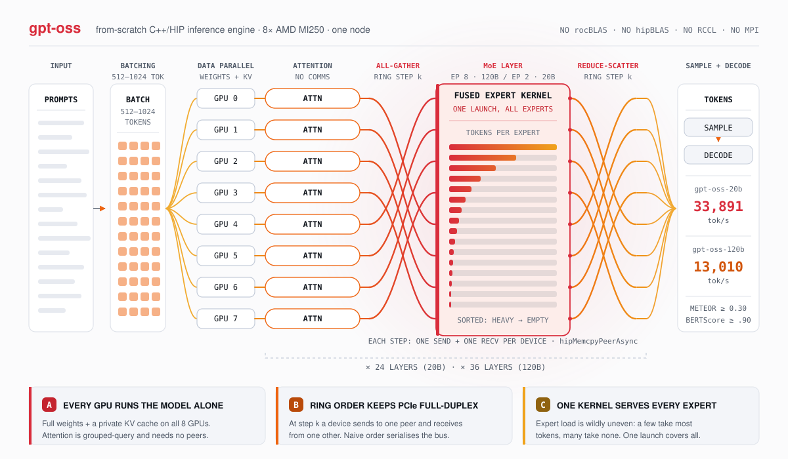

# The getp batch serving runtime

`getp` is the mode every throughput number in this repository comes from. It is deliberately not a
server: the whole workload is known before the first token is produced, every request is resident on
a GPU for the entire run, and the schedule is frozen at start-up. There is no queue, no continuous
batching, no eviction and no work stealing. That closed-world assumption is what makes 12288
sequences advance in lockstep at 33891 tokens per second on eight MI250 GCDs, and it is also the
source of every limitation described on this page. The machinery lives in five places:
[`src/getp/run.cpp`](../src/getp/run.cpp), [`src/getp/transformer.cpp`](../src/getp/transformer.cpp),
[`src/getp/state_ext.cpp`](../src/getp/state_ext.cpp),
[`include/barrier.hpp`](../include/barrier.hpp), and the single device-side driver
`getp_forward_120b` in [`src/hip/forward.hip`](../src/hip/forward.hip). Both models call that same
driver; `getp_forward_20b` exists in the file but has no call sites. It is not merely dead, it is
broken: it takes a `batch_size` parameter and then sizes its KV-cache offsets from the global
`BATCH_SIZE` (`base_off = layer_toff * (size_t)BATCH_SIZE * (size_t)kv_dim`,
[`forward.hip:3891`](../src/hip/forward.hip)), so any call with `batch_size != BATCH_SIZE` would
read and write the wrong cache rows. Reviving it means fixing that line first.

<picture>
  <source media="(prefers-color-scheme: dark)" srcset="assets/serving-dark.svg">
  
</picture>

## Intake: an arena, not a queue

`read_inputfile` in [`src/getp/eval.cpp`](../src/getp/eval.cpp) is part of the fixed harness and may
not be modified. It reads a request count from the first line of the input file and copies each
subsequent line verbatim into two flat arenas:

| Arena | Stride per request | Holds |
| --- | --- | --- |
| `str_reqs` | `max_token_len × (max_seq_len + 1)` bytes | the raw prompt text |
| `tok_gens` | `max_seq_len + 1` ints | the generated token ids, `-1`-terminated |

Both are `calloc`ed whole in `build_requests` ([`src/getp/eval.cpp:17-28`](../src/getp/eval.cpp)).
The `max_seq_len` passed in is `steps`, that is the `-n` value clamped to the model's `seq_len`, so
the arena grows with the step budget rather than with the prompts. The product is large enough to be
worth stating. At the 12288 requests the 20B path demands, the default `-n 1024`, and
`max_token_length` (the longest token in `tokenizer.bin`) at 128, `str_reqs` is
12288 × 128 × 1025 ≈ **1.6 GB** of zeroed host memory and `tok_gens` a further
12288 × 1025 × 4 ≈ **50 MB**. Both are allocated and touched before any GPU is opened, on the same
host that is about to fault an 84 GB checkpoint through eight upload threads. Note also that every
request gets the same slot whatever its prompt length, and the benchmark prompts are around 71
characters, so well over 99 % of that 1.6 GB is zeros.

That product is also computed in `int` before it reaches `calloc`: 1.6 × 10⁹ still fits in a signed
32-bit integer, but the same expression for a 16-device 20B run (24576 requests) would be
3.2 × 10⁹ and overflow. The arena is sized for the batch the runtime was built for and not much
more.

There are no arrival times, no priorities and no per-request objects. A request is an index. Everything
downstream partitions that index space arithmetically, which is why the runtime needs no locking on
the request side at all.

The benchmark workload the design targets is short-prompt, long-output. In
[`tests/input.txt`](../tests/input.txt) prompts average 71.1 characters (roughly 14 tokens) with a
maximum of 125 characters, while the 20B reference outputs in
[`tests/references/output_20b_token_ids.txt`](../tests/references/output_20b_token_ids.txt) average
991.4 tokens against a 1020 maximum. Nearly every sequence runs to the step limit. Hold that fact:
it justifies most of what follows.

## Partitioning: model groups

`inference()` splits the devices into independent model groups. With `n_devices = 8`:

```
int n_parallel_models = n_devices / EXPERT_PARALLELISM;
int num_reqs_per_device = requests->num_reqs / n_parallel_models;
```

Group *g* owns the contiguous request slice `[g·N/n_parallel_models, (g+1)·N/n_parallel_models)`
([`src/getp/run.cpp:510-520`](../src/getp/run.cpp)). Groups share nothing — not weights, not KV
cache, not a barrier. For the 20B model with `EXPERT_PARALLELISM = 2` there are four groups of two
GPUs; for the 120B model with `EXPERT_PARALLELISM = 8` there is one group of eight.

How rigid the partition is differs between the two paths:

| | 20B | 120B |
| --- | --- | --- |
| Model groups on 8 GPUs | 4 (2 GPUs each) | 1 (8 GPUs) |
| Rows per device (`BATCH_SIZE`) | 1536 | 768 |
| Requests per group | 3072 | 6144 |
| Accepted request count | exactly `n_devices × 1536` (12288 on 8 GPUs) | any multiple of `n_devices × 768` (6144 on 8 GPUs) — but only on exactly 8 GPUs |
| Enforced by | two asserts at [`run.cpp:268-269`](../src/getp/run.cpp) | the chunk loop in `Model_120b::distribute_requests` |

`Model_20b::distribute_requests` asserts both `n_parallel_models * requests_per_model ==
requests->num_reqs` and `requests_per_model == EXPERT_PARALLELISM * BATCH_SIZE`, so on eight GPUs
12288 = 4 groups × EP 2 × 1536 is the only count that runs. `Model_120b::distribute_requests` carries neither assert;
it loops `for (idx = 0; idx < requests_per_model; idx += EXPERT_PARALLELISM * BATCH_SIZE)`, spawning
a fresh thread set and a fresh `Barrier` for each 6144-request chunk and fully joining one chunk
before starting the next. Both paths share the divisibility assert at
[`run.cpp:518`](../src/getp/run.cpp).

Which of the two `distribute_requests` implementations you get is decided by a bare
`if (EXPERT_PARALLELISM == 8)` at [`run.cpp:524`](../src/getp/run.cpp), and that is a trap on a node
with any other device count. The 120B path sets `EXPERT_PARALLELISM = n_devices`, so on four GPUs
`EXPERT_PARALLELISM` is 4, the `== 8` test fails, and the 120B model is dispatched into
`Model_20b::distribute_requests` — with the 120B `BATCH_SIZE` of 768. The run is not wrong, but it is
not what the table above says: the chunk loop is gone, so instead of "any multiple of 6144" you get
exactly one accepted count, `n_devices × 768` = 3072, enforced by the 20B asserts. The "any multiple
of 6144" row holds on exactly eight devices and nowhere else.

The same loop contains an index confusion that is inert but confusing to read:
`if (i == n_parallel_models - 1) workers[i].request_end = requests->num_reqs;` compares the *device*
index `i` (0, 2, 4, 6 for the 20B model) against `n_parallel_models - 1` (3), so it never fires for
the 20B model; for the 120B model it fires on the only group, where it is already a no-op.

## Building an input file that runs

This is the first thing that stops anyone trying to reproduce the numbers, so it gets its own
section. `getp` accepts exactly one request count, and no input file shipped in this repository is
that count.

**The rule.** `Model_20b::distribute_requests` asserts two things
([`run.cpp:268-269`](../src/getp/run.cpp)):

```cpp
assert(n_parallel_models * requests_per_model == requests->num_reqs);
assert(requests_per_model == EXPERT_PARALLELISM * BATCH_SIZE);
```

With `n_parallel_models = n_devices / EXPERT_PARALLELISM`, the two collapse into one arithmetic
condition on the first line of the input file:

```
num_reqs == n_devices × BATCH_SIZE
```

`BATCH_SIZE` is 1536 for the 20B model and 768 for the 120B model, hard-coded in `warm_up`. So on
eight GPUs:

| Model | `EXPERT_PARALLELISM` | `BATCH_SIZE` | Required `num_reqs` on 8 GPUs |
| --- | --- | --- | --- |
| 20B | 2 | 1536 | 8 × 1536 = **12288** |
| 120B | 8 | 768 | 8 × 768 = **6144**, or any multiple of it |

Those are exactly the two "sequences in flight" figures in the results table. They are not defaults
you get for free; they are the only counts the runtime accepts.

**What happens if you get it wrong.** The assert fires and the process dies at
[`run.cpp:268-269`](../src/getp/run.cpp) — after warm-up has already spent 180 s or 390 s uploading
weights, because request distribution happens after `warm_up` returns. No target in the
[`Makefile`](../Makefile) passes `-DNDEBUG`, so the asserts are live in the optimised build too;
there is no configuration in which a wrong count silently produces a short run. On a device count
other than eight, add the dispatch trap described above: the 120B model lands in the 20B code path
and inherits these same two asserts.

**Every shipped input fails it**, not just the obvious one:

| File | Declared requests | Runs on 8 GPUs? |
| --- | --- | --- |
| [`tests/input.txt`](../tests/input.txt) | 4096 | no — needs 12288 (20B) or a multiple of 6144 (120B) |
| [`tests/data/input.txt`](../tests/data/input.txt) | 32 | no |
| `tests/data/input_test.txt` | 256 | no |
| `tests/data/input_original.txt` | 448 | no |
| `tests/data/input-multi.txt` | 3584 | no |

[`run.sh`](../run.sh) no longer points its worked example at any of them: its usage text states the
rule outright and its `getp` example builds a file with `mkinput` first (`run.sh:59-62`). Invoking
the binary by hand against a shipped file still aborts at the assert on an eight-GPU node. The two
reference files, [`tests/references/output_20b_token_ids.txt`](../tests/references/output_20b_token_ids.txt)
and `output_120b_token_ids.txt`, have 4096 lines each, so they match neither accepted count and
cannot be compared row-for-row against a valid 12288- or 6144-request run.

**Making a valid file.** [`tools/make_getp_input.py`](../tools/make_getp_input.py) computes
`n_devices × BATCH_SIZE` and repeats a prompt pool until the file holds exactly that many lines,
with the count on the first line:

```sh
# 12288 prompts for the 20B model on 8 GPUs, from the shipped pool
python3 tools/make_getp_input.py -m 20b -g 8 -o input_20b.txt

# 6144 for the 120B model on 8 GPUs
python3 tools/make_getp_input.py -m 120b -g 8 -o input_120b.txt

# your own prompts, one per line, on a two-GPU box
python3 tools/make_getp_input.py -m 20b -g 2 -s my_prompts.txt -o input.txt
```

It also rejects any prompt at or over `max_token_length × (steps + 1)` bytes, which is the size of
the per-request slot `read_inputfile` copies into. Repeating a small pool is fine for a throughput
measurement — every row still runs a full 1024-step forward pass and contributes its tokens — but the
outputs are redundant, so a quality score computed over such a file measures the distinct prompts in
the pool, not 12288 independent ones.

## Batch size and expert parallelism are chosen by a single `if`

There is no memory probe and no auto-tuning. `warm_up` branches on the expert count and hard-codes
both knobs ([`src/getp/run.cpp:47-57`](../src/getp/run.cpp)):

```cpp
if (p->n_experts == 128) {
  // 120b model
  EXPERT_PARALLELISM = n_devices;
  BATCH_SIZE = 768;
}
else {
  // 20b model
  EXPERT_PARALLELISM = 2;
  BATCH_SIZE = 1536;
  // BATCH_SIZE = 256;
}
```

The reasoning behind the two settings is spelled out in [PARALLELISM.md](PARALLELISM.md): expert
parallelism is a memory lever first and a compute lever second. The 20B model fits on a single
64 GB MI250 GCD, but sharding its 32 experts across two devices halves the expert footprint and buys
room to double the batch. The 120B model has no choice — its 128 experts must spread across all
eight devices. Both end at 16 experts per device (`experts_per_device = p->n_experts /
EXPERT_PARALLELISM`), which is why the MoE kernel sees the same expert count in both configurations.

`BATCH_SIZE` is where the throughput comes from. Every GEMM in the model has `M = BATCH_SIZE`; the
tile shapes in [KERNELS.md](KERNELS.md) assume `M` in the thousands, and a weight row fetched from
HBM is amortised over `M` rows of activation. Dropping to the commented-out 256 would leave the
matrix cores starved. Raising it further is blocked by the KV cache.

`MAXIMUM_GPU` (8, in [`include/transformer.hpp`](../include/transformer.hpp)) constrains exactly one
thing: `hipEvent_t events_e_agg[MAXIMUM_GPU]` in `getp_forward_120b`
([`forward.hip:3545`](../src/hip/forward.hip)), the fixed-size array of per-peer completion events
used by the expert-aggregate exchange. Because the 120B path sets `EXPERT_PARALLELISM = n_devices`
with no clamp, a node exposing more than eight HIP devices would write past that array.

One structural fact about the tree is worth stating here, because several behaviours on this page
follow from it. `include/transformer.hpp:8` reads `int EXPERT_PARALLELISM = 8;` — a *definition* in a
header, not a declaration. That would be a duplicate-symbol link error in a normal multi-file build.
It works because the whole program is a single translation unit assembled by `#include`-ing `.cpp`
files: [`src/run.cpp`](../src/run.cpp) includes `getp/eval.cpp` and then `getp/run.cpp`, which in
turn includes `collectives.cpp`, `state_ext.cpp` and `transformer.cpp`. There is one object file. The
practical consequence is that include *order* decides which of several competing `#define`s wins —
see the `HIP_CHECK` note in the next section.

## KV cache sizing

`init_device_run_state` ([`src/getp/transformer.cpp:228-236`](../src/getp/transformer.cpp)) does not
allocate `n_layers × seq_len` time slots. It exploits the fact that gpt-oss alternates attention
types layer by layer, and it halves the cache twice:

```cpp
const int even_layers = (p->n_layers + 1) / 2;
const int even_tcap = (p->sliding_window > 0 ? p->sliding_window : 1);
int odd_tcap = p->seq_len / 2;
if (odd_tcap < 1) odd_tcap = 1;
const size_t total_t = (size_t)even_layers * (size_t)even_tcap +
                       (size_t)(p->n_layers - even_layers) * (size_t)odd_tcap;
```

- **Even layers** use sliding-window attention with `sliding_window = 128`, so they get exactly 128
  slots and index them as a ring, `tslot = pos % cache_tcap`. Nothing older than 128 positions is
  ever read, so nothing older is stored.
- **Odd layers** are nominally full attention, but get `seq_len / 2` slots rather than `seq_len`.
- Both are stored in bf16, not fp32.

The kernels match the caps honestly rather than reading stale ring entries: the odd-layer kernel
starts at `t_start = MAX(0, pos + 1 - cache_tcap)`
([`forward.hip:2559`](../src/hip/forward.hip)) and the even-layer twin at
`MAX(0, pos - sliding_window + 1)` ([`forward.hip:2304`](../src/hip/forward.hip)), and both index the
ring with `index_y % cache_tcap`. So "full" attention is really a `seq_len/2` window. At the shipped
`max_seq_len` of 2048 that is 1024 slots, so below the default 1024 steps it is exact. Above it, the
model silently attends to a truncated history — a real correctness limit, not a tuning parameter. Note
that the cap follows the checkpoint, not the step count: halve `seq_len` and you halve the window,
which is why the re-export advice below comes with a warning attached.

The resulting sizes, with `kv_dim = head_dim × n_kv_heads = 64 × 8 = 512`, so K+V in bf16 costs
exactly 2 KiB per time slot per batch row:

| Model | `seq_len` | Slots per device | Per row | Per device (B rows) |
| --- | --- | --- | --- | --- |
| 20B (24 layers, B=1536) | 2048 | 12×128 + 12×1024 = 13824 | 28.3 MB | 43.49 GB |
| 20B | 1024 | 12×128 + 12×512 = 7680 | 15.7 MB | 24.16 GB |
| 120B (36 layers, B=768) | 2048 | 18×128 + 18×1024 = 20736 | 42.5 MB | 32.61 GB |
| 120B | 1024 | 18×128 + 18×512 = 11520 | 23.6 MB | 18.12 GB |

For comparison, take the naive version of the same thing: every layer given all `seq_len` slots, in
fp32. For the 20B configuration at `seq_len` 2048 that is 24 × 2048 × 512 × 4 B × 1536 =
**154.6 GB per device for K**, and the same again for V, so **309.2 GB** in total. The three halvings
together bring that to 43.49 GB, a factor of **7.11×** — which is exactly the 3.56× slot reduction
(49152 naive slots down to 13824) multiplied by the 2× from storing bf16 instead of fp32. Comparing
against a K-only baseline would credit the slot reduction alone and give bf16 nothing.

Weights are the other resident cost, and they are comfortably accounted for:

| Model | Dense bf16 | Expert shard (16 experts) | Total per device |
| --- | --- | --- | --- |
| 20B | 3.60 GB | 19.12 GB | 22.7 GB |
| 120B | 4.26 GB | 28.68 GB | 32.9 GB |

Put the two tables together and the shipped constants do not fit the shipped `config.json`. With
`max_seq_len = 2048` from [`tools/model_export/gpt-oss-20b/config.json`](../tools/model_export/gpt-oss-20b/config.json),
the 20B configuration needs 43.5 + 22.7 ≈ 66 GB per device, more than a 64 GB MI250 GCD holds. The
constants only fit a checkpoint exported with a smaller `max_seq_len`; at 1024 the total is about
47 GB.

Nothing in the code checks in advance — there is no memory probe and no capacity assert. What does
happen is an abort. Three different `HIP_CHECK` macros are defined in this tree, and because it is
one translation unit (see above) the one that wins is the one whose header is included first:
[`src/getp/run.cpp:6`](../src/getp/run.cpp) pulls in `collectives.cpp`, which pulls in
[`include/collectives.hpp`](../include/collectives.hpp), whose `HIP_CHECK` prints and then calls
`abort()`. The gentler definitions in [`src/getp/state_ext.cpp:5`](../src/getp/state_ext.cpp) and
[`src/getp/transformer.cpp:13`](../src/getp/transformer.cpp) are both `#ifndef HIP_CHECK`-guarded and
never take effect. So a failing `hipMalloc` in `init_device_run_state` kills the process at warm-up,
with the file and line of the allocation that did not fit. That is the failure mode to expect: a hard
stop before any token is produced, not silent corruption during the run.

**If you re-export the model, do not simply drop `max_seq_len` to 1024.** The export `max_seq_len`
becomes the config `seq_len`, and `odd_tcap = p->seq_len / 2`
([`transformer.cpp:230`](../src/getp/transformer.cpp)), so exporting at 1024 sets the odd layers'
cache to 512 slots. The default run is 1024 steps, so half the layers would start discarding history
at position 512 — inside the measured run, not beyond it, and with no warning. The export
`max_seq_len` is a batch-size knob and an attention-window knob at the same time, and the two pull in
opposite directions: it must be at least twice the number of steps you intend to run for the odd
layers to be exact, and small enough that `seq_len/2` slots per odd layer still fit alongside the
weights. At `BATCH_SIZE = 1536` on a 64 GB GCD those two constraints do not both hold for a
1024-step run; something has to give, and the honest levers are `BATCH_SIZE` and the step count.

The layout is `[layer][t][batch][kv_dim]` — batch-major *inside* a time slot
([`forward.hip:3586-3596`](../src/hip/forward.hip)). That ordering exists for the write side: every
step writes one slot for all 1536 rows at once, and batch-major makes that write fully coalesced.
The read side pays for it with a strided gather, which the flash-decode kernel absorbs by staging
`FLASH_DECODE_TILE_T = 16` positions at a time into shared memory, one thread block per
(`n_kv_heads = 8`, batch row) pair ([`forward.hip:2754-2772`](../src/hip/forward.hip)).

At the shipped 20B settings the marginal cost of one more sequence in the batch is about **16.1 MB**
at `seq_len` 1024. The table row above accounts for 15.7 MB of that — it is KV only. The remaining
0.38 MB, 2.4 % of the total, is the rest of the per-row state, and it is worth naming rather than
waving away:

- ~79 KB of `RunState` per row: `x`, `t`, `tb2` and `e_agg` at `hidden_dim` fp32, plus `tb` and `q`
  at `n_attn_heads × head_dim` fp32 ([`transformer.cpp:213-226`](../src/getp/transformer.cpp)).
- ~265 KB of `RunStateExt` per row. Almost every buffer in `ext_alloc_device`
  ([`src/getp/state_ext.cpp:20-75`](../src/getp/state_ext.cpp)) is sized
  `EXPERT_PARALLELISM × batch_size × …`, so at `EXPERT_PARALLELISM = 2` each local row is charged
  twice. The largest single item is `z_partial` at `experts_per_token × hidden_dim` fp32 — 46 KB per
  group row, 92 KB per local row.
- ~37 KB of per-device staging: `pre_qkv_bf16`, `attn_o_bf16` and the `allreduce_tmp` scratch that
  the never-called generic collectives would have used.

KV still dominates by a factor of forty, which is why the sizing argument above is the one that
matters — but 0.38 MB × 1536 rows is 0.58 GB, which is not nothing on a device that is already
2 GB over budget at `seq_len` 2048.

## Warm-up: where 180 s and 390 s go

`warm_up` is forbidden from running inference. Its whole job is getting weights onto the GPUs, and it
is timed separately from the throughput measurement in
[`src/getp/eval.cpp:123-126`](../src/getp/eval.cpp). It spawns one `std::thread` per device running
`upload_transformer`, joins them, allocates the MoE extension buffers with `ext_alloc_device`, and
calls `cgCreate` — which does nothing but create one more, unused, stream per device.

The time is not I/O bandwidth alone. It is a scalar format conversion on the host. The exporter in
[`tools/model_export`](../tools/model_export) writes float32 by default, and the loader mmaps the
checkpoint as `float *`, so every tensor that the kernels want in bf16 has to be converted
element-by-element on the CPU first:

```cpp
void getp_memcpy_fp32_to_bf16(__hip_bfloat16 *dst, float *src, int n_elements) {
  // Use pinned memory for faster host-to-device transfer
  __hip_bfloat16 *tmp = nullptr;
  HIP_CHECK(hipHostMalloc(&tmp, sizeof(__hip_bfloat16) * n_elements, hipHostMallocDefault));

  // Convert FP32 to BF16 on host
  for (int i = 0; i < n_elements; ++i) tmp[i] = __float2bfloat16(src[i]);

  // Use async copy for better performance
  HIP_CHECK(hipMemcpyAsync(dst, tmp, sizeof(__hip_bfloat16) * n_elements,
                      hipMemcpyHostToDevice, 0));
  HIP_CHECK(hipStreamSynchronize(0));

  HIP_CHECK(hipHostFree(tmp));
}
```

Note the shape of the call: one pinned allocation the full size of the destination tensor, one scalar
loop, one copy, a null-stream synchronize, one free. It is called 104 times per device for the 20B
model (8 dense tensors plus four per layer × 24 layers) and 152 times for the 120B model
(8 + 4 × 36). The largest staging buffers are 1.16 GB for the embedding and unembedding tables
(579 M elements each) and 531 MB for one layer's `w_mlp1` shard.

| | 20B | 120B |
| --- | --- | --- |
| Checkpoint on disk (fp32) | 83.7 GB (20.91 B params) | 467.3 GB (116.8 B params) |
| `getp_memcpy_fp32_to_bf16` calls per device | 104 | 152 |
| Scalar `__float2bfloat16` per thread | 11.36 × 10⁹ | 16.47 × 10⁹ |
| Measured warm-up | 180 s | 390 s |

Only four tensors escape the conversion and stay in fp32 — the two per-layer rmsnorm scales, the
final norm, and the attention sinks. They share one pinned buffer and a plain `memcpy`.

Eight threads do all of this concurrently, each faulting in its own slice of the mmap'd checkpoint
and each hammering the same process-wide pinned-memory allocator. That is the whole of the 180 s and
390 s: page faults, a scalar loop, and pinned-buffer churn. No kernel runs during warm-up, and
nothing is cached between runs.

Two things would cut it, and neither is implemented here. Exporting the checkpoint in bf16 would
remove both the conversion loop and half the bytes read from disk. Reusing one staging buffer per
thread, sized to the largest tensor, would remove 104 or 152 pinned allocations per device. The cost
is tolerated because the harness reports warm-up separately from throughput.

## Host threading and the barrier

Steady state is eight host threads, one per GPU in both configurations. Each pins itself to its own
core on entry, so for the 20B model the four groups land on core pairs (0,1), (2,3), (4,5), (6,7):

```cpp
cpu_set_t cpuset;
CPU_ZERO(&cpuset);
CPU_SET(base_thread_idx + thread_idx_offset, &cpuset);
sched_setaffinity(0, sizeof(cpu_set_t), &cpuset);
```

Pinning matters more than it looks. These threads spin rather than sleep, and they do so while
holding a device context; letting the scheduler migrate them adds jitter to every barrier crossing,
and there are 49 of those per token step on the 20B model.

Threads inside one model group coordinate through `Barrier`
([`include/barrier.hpp`](../include/barrier.hpp)), a sense-reversing spin barrier over two atomics:

```cpp
void wait() {
  int p = phase.load(std::memory_order_relaxed);
  if (count.fetch_add(1, std::memory_order_acq_rel) == n_threads - 1) {
    count.store(0, std::memory_order_release);
    phase.fetch_add(1, std::memory_order_release);
  } else {
    while (phase.load(std::memory_order_acquire) == p) {
      std::this_thread::yield();
    }
  }
}
```

The last arriver resets `count` and bumps `phase`; everyone else spins on `phase`, yielding between
checks. There is no mutex and no condition variable, because the expected wait is microseconds — the
threads are running the same layer of the same model on identically sized work, so they arrive within
a kernel launch of each other. A condition variable would cost more to sleep and wake than the wait
itself. The `yield()` is the concession to correctness if that assumption breaks.

Each 20B model group allocates its own `Barrier` on the heap, so the four groups never touch each
other's cache lines. The 120B path builds one on the stack per 6144-request chunk.

The composite primitive is `sync_workers` ([`forward.hip:3503`](../src/hip/forward.hip)):

```cpp
inline void sync_workers(hipStream_t stream, Barrier &sync_point) {
  HIP_CHECK(hipStreamSynchronize(stream));
  sync_point.wait();
}
```

Synchronize this thread's compute stream, then wait on the barrier. After it returns, this device's
work is complete *and* every peer has reached the same point — which is exactly the precondition for
reading a buffer a peer just wrote by `hipMemcpyPeerAsync`. It runs twice per layer: once after the
hidden-state and router all-gather, once after the MoE aggregate.

| Model | Layers | `sync_workers` per layer | Barrier crossings per token step |
| --- | --- | --- | --- |
| 20B | 24 | 2 | 2 × 24 + 1 = 49 |
| 120B | 36 | 2 | 2 × 36 + 1 = 73 |

The `+ 1` is the third barrier, and it is easy to miss because it lives outside the forward pass:
`sync_point.wait()` at [`run.cpp:218`](../src/getp/run.cpp), on the same `Barrier` object, is what
lets every thread in the group see the same `thread_states` array before deciding whether to exit.
It is step 5 of the end-to-end list below.

## HIP streams and overlap

Each `DeviceTransformer` creates four non-blocking streams
([`transformer.cpp:283-286`](../src/getp/transformer.cpp)), but the live path uses two.
`h2d_stream` and `d2h_stream` are referenced only by `getp_forward_20b`, which nothing calls, and
`cgCreate` adds a fifth per-device stream that only the never-called generic collectives in
[`src/getp/collectives.cpp`](../src/getp/collectives.cpp) touch. The two that matter:

| Stream | Carries |
| --- | --- |
| `compute_stream` | every kernel, plus the final argmax read-back |
| `memory_stream` | all `hipMemcpyPeerAsync` traffic and the aggregate `hipMemsetAsync` |

Overlap is real but narrow, and it is event-driven rather than stream-priority driven. Three places
in the layer body actually hide work:

1. **Hidden-state all-gather behind the router GEMM.** `hipEventRecord(event_rmsnorm,
   compute_stream)` is issued right after the FFN rmsnorm; `memory_stream` waits on it and then
   converts `ext_t` to bf16 and peer-copies it, while `compute_stream` proceeds into the router GEMM
   and top-k ([`forward.hip:3670-3690`](../src/hip/forward.hip)). This is the one substantial win.
2. **Aggregate memset behind both MLPs.** `hipMemsetAsync` of `ext_e_agg` is issued on
   `memory_stream` and tagged with `event_memset` ([`forward.hip:3755`](../src/hip/forward.hip)); the
   wait is only placed before `moe_gather_pairs` ([`3777`](../src/hip/forward.hip)), so the zeroing
   of `EXPERT_PARALLELISM × BATCH_SIZE × hidden_dim` floats hides behind MLP1 and MLP2.
3. **Expert-aggregate reduction interleaved with its copies.** Each peer copy records its own
   `events_e_agg[j]`, and the matching `getp_vecadd` waits only on that one event
   ([`forward.hip:3789-3813`](../src/hip/forward.hip)), so reduction of peer *j* overlaps the arrival
   of peer *j+1*.

Against that, the top-k tensors are a missed opportunity: their peer copies are issued on
`memory_stream` but behind `hipStreamWaitEvent(memory_stream, event_router_topk)`
([`3692`](../src/hip/forward.hip)), and `event_router_topk` is the last thing the compute stream
records before the sync. Those copies overlap nothing and sit on the critical path.

The ordering of the peer copies themselves — `for (delta = 1; delta < EXPERT_PARALLELISM; ++delta)`,
target `(device_index + delta) % EXPERT_PARALLELISM` — is the full-duplex-friendly ring described in
[PARALLELISM.md](PARALLELISM.md). At `EXPERT_PARALLELISM = 2` it degenerates to a single peer, which
is part of why the 20B configuration scales so cleanly.

### Host synchronisations on the critical path

Overlap is bounded by how often the host has to stop and look at the device. Per layer there are five
host-side stream synchronisations plus a pageable device-to-host read:

| Site | Why |
| --- | --- |
| [`forward.hip:225`](../src/hip/forward.hip), inside `build_moe_block_schedule` | reads `total_blocks` to size the bucketed MLP launch |
| [`forward.hip:268`](../src/hip/forward.hip), inside `build_moe_buckets_local_pos` | reads the expert-offset array to compute `cap_pairs` |
| [`forward.hip:3716`](../src/hip/forward.hip), `hipStreamSynchronize(memory_stream)` | the peer copies must land before the barrier |
| [`forward.hip:3717`](../src/hip/forward.hip), inside `sync_workers` | compute-stream drain before the barrier |
| [`forward.hip:3734`](../src/hip/forward.hip), `hipMemcpyAsync` of `total_pairs` into a stack `int` | grid size for the scatter kernel |
| [`forward.hip:3782`](../src/hip/forward.hip), inside `sync_workers` | compute-stream drain after the MoE aggregate |

The MoE read-backs are not laziness. Block counts depend on data-dependent expert occupancy — how
many of the `EXPERT_PARALLELISM × BATCH_SIZE × 4` (token, expert) pairs landed on each of this
device's 16 experts — and the launch geometry for the bucketed MLP kernels is sized from that count
at `MATMUL_MLP1_BLOCK_ROWS = 64` rows per block. The code acknowledges the cost in place:

```cpp
// TODO: get rid of stream synchronize,
// although the synchorization is not a big bottleneck
```

A device-side launch or a persistent kernel would remove them; neither is implemented.

The `total_pairs` row is the odd one out and deserves a note, because it reads like a bug and is not
one. The copy at [`forward.hip:3734`](../src/hip/forward.hip) is asynchronous and has no synchronize
of its own, yet `total_pairs` is consumed on the host fifteen lines later as the grid extent for
`moe_scatter_acts_to_expert_frombf16`. What makes that safe is the call in between:
`build_moe_block_schedule` is issued on the same `compute_stream` and ends in
`hipStreamSynchronize(stream)` ([`forward.hip:225`](../src/hip/forward.hip)), which drains the
earlier copy as well. The dependency is real but implicit — delete or reorder the schedule build and
the scatter kernel silently gets a stale grid size.

### Allocator round-trips

Allocation also sits on the critical path, and it is cheap to overlook.

| Frequency | Call | Site |
| --- | --- | --- |
| Per token step | `hipMalloc` / `hipFree` of the argmax pair buffer | [`forward.hip:3438`, `3446`](../src/hip/forward.hip) |
| Per token step | `hipHostMalloc` / `hipHostFree` of the `next_host` result buffer | [`forward.hip:3825`](../src/hip/forward.hip), freed at [`run.cpp:231`](../src/getp/run.cpp) |
| Per **layer** | `hipMallocAsync` / `hipFreeAsync` of the split-K partials in `getp_matmul_router_bf16` | [`forward.hip:2853`, `2878`](../src/hip/forward.hip) |

The first row is worse than "a round-trip". `hipFree` is device-synchronising: it blocks the calling
thread until every kernel queued on every stream of that device has finished. So
`HIP_CHECK(hipFree(pairs))` at [`forward.hip:3446`](../src/hip/forward.hip), immediately after the
`extract_argmax_pairs` launch, is a full-device barrier on the critical path of every token step. The
table of stream synchronisations above does not cover it, because that table is per layer and this
happens once per step, at the end. It buys nothing in ordering terms: the argmax result is read back on `compute_stream` at
[`forward.hip:3826`](../src/hip/forward.hip) and is already stream-ordered behind the kernel that
wrote it. Allocating `pairs` once in `ext_alloc_device` would remove both the allocation and the
barrier.

The router case is the surprising one. `getp_matmul_router_bf16` always takes its split-K branch on
this shape: the router grid is 48 CTAs against a target of `cu × 4` ≈ 416, so `splits` saturates at
8, and the allocation happens on every layer, preceded by a `hipGetDevice` and a
`hipDeviceGetAttribute`. That is 24 extra allocator round-trips per 20B step and 36 per 120B step.
All three buffers are fixed-size for the life of the run and could be allocated once in
`ext_alloc_device`.

`hipEvent_t` objects are created at the top of every call to `getp_forward_120b` and never destroyed:
`3 + EXPERT_PARALLELISM` per step per thread, so 5 for the 20B model and 11 for the 120B model
([`forward.hip:3546-3549`](../src/hip/forward.hip)). Over 1023 steps that is roughly 5 000 leaked
events per 20B thread.

## One request, end to end

A worker thread starts by tokenising all 1536 (or 768) of its prompts into one pinned block —
sized once, sliced per request, so there is a single `hipHostMalloc` rather than `BATCH_SIZE` of
them. `encode` is called with `bos = -1, eos = -1`, so neither marker is emitted and no chat
template is applied; the cap passed is `initial_context_length` (4096), not `steps`.

Then the lockstep loop ([`src/getp/run.cpp:191-232`](../src/getp/run.cpp)), driven by a single shared
`pos`:

1. `getp_forward_120b` runs the whole batch for position `pos` and returns a pinned array of argmax
   token ids.
2. `pos++`. For each live row, if `pos < nums_prompt_tokens[b]` the prediction is discarded and
   replaced by the next prompt token; otherwise `next_gpu[b]` is recorded into `tok_gens`.
3. A row that produced `199999` (`<|endoftext|>`) or `200002` (`<|return|>`) has its `mask[b]`
   cleared.
4. If every row on this thread is finished, the thread clears its slot in `thread_states`.
5. `sync_point.wait()`, then every thread checks `is_all_zero(thread_states, EXPERT_PARALLELISM)`.
   The group exits only when all threads in it are done.

There is **no prefill phase**. Prompt tokens are fed one position per step exactly like generated
tokens. That is a real inefficiency on paper — it burns one full forward pass per prompt token — and
it is tolerated only because the benchmark prompts average about 14 tokens against roughly 1000
generated. The decode kernels are already tuned for `M = BATCH_SIZE` with a sequence length of one,
so a separate prefill path would mean a second set of GEMM and attention kernels for about 1.4 % of
the work.

The unembedding GEMM and the argmax are fused into one kernel
([`forward.hip:3819`](../src/hip/forward.hip)). Each block reduces its own tile of the logits into a
packed `(value, index)` pair with `atomic_update_max_pair`, so the full logits tensor is never
written to memory. At 1536 × 201088 fp32 that is 1.24 GB per step of HBM traffic avoided, and
`s->logits`, `s->att` and `s->qkv` are all left null in `init_device_run_state`
([`transformer.cpp:240`](../src/getp/transformer.cpp)).

Sampling is greedy throughout. Both `distribute_requests` variants pass `(Sampler *)NULL`, so `-t`
and `-p` have no effect in this mode. That is deliberate: argmax is what makes the fusion above
possible, and the quality target is METEOR ≥ 0.3 / BERTScore ≥ 0.9 against a reference, not sample
diversity.

Two sharp edges in this loop are worth naming. First, `mask_on` reaches only the attention kernels,
which honour it with an early `if (!mask_on[b]) return;`. The dense GEMMs, the router and the entire
MoE still process finished rows at full cost — so a row that stops early frees attention work and
nothing else. Second, each row is terminated with a `-1` sentinel at
`epos[b] - nums_prompt_tokens[b] + 1`, which `write_outputfile` uses as the end marker. Because
`encode` caps prompts at `initial_context_length` (4096) rather than at `steps` (1024), a prompt
longer than the step budget makes that index negative and writes before the start of its own output
row.

## Where the throughput number comes from

The harness times `inference()` end to end and divides the accumulated output token count by the wall
time. Two facts about the measurement before the arithmetic. The binary is the `runfast` target —
`hipcc --std=c++17 --offload-arch=gfx90a -O3` ([`Makefile`](../Makefile)) — and *not* the default
`make run` target, which is the one target that drops `$(CFLAGS)` and builds at `-O0` with no offload
arch at all. And the input is a 12288- or 6144-request file built as described above, since no
shipped one runs. Working backwards from the published figures:

| | 20B | 120B |
| --- | --- | --- |
| Sequences in flight | 12288 | 6144 |
| Forward passes (`-n 1024`, `while (pos + 1 < steps)`) | 1023 | 1023 |
| Published throughput | 33891 tok/s | 13010 tok/s |
| Implied token-step time | 363 ms | 472 ms |
| Barrier crossings per step | 49 | 73 |
| Host stream syncs per step | ≈ 120 | ≈ 180 |

Both figures are averages over a run whose step time grows. The odd layers' attention work scales
with `pos + 1 - t_start` until the `seq_len/2` cap is reached, while the even layers stay pinned at
128 positions regardless of `pos`. Early steps are therefore cheaper than late ones, and the
alternating layer design caps how badly the tail degrades: half the layers never grow at all.

The design has one structural idle cost. A group runs until its *last* sequence finishes; when it
does, its GPUs sit idle while other groups continue. On this workload that costs almost nothing,
because the reference outputs average 991.4 of a possible 1020 tokens — nearly every sequence runs to
the step limit. That is precisely the assumption the runtime was built on, and it is the assumption
that would break first on a workload with a wide output-length distribution.

## Known limits

Collected in one place, in rough order of how likely they are to bite:

- **No continuous batching.** A finished row holds its slot, its KV cache and its share of every
  dense GEMM until the whole group stops.
- **Fixed request counts.** `num_reqs` must be `n_devices × BATCH_SIZE`: 12288 for the 20B model on
  8 GPUs, a multiple of 6144 for the 120B model on 8 GPUs. *Every* input file in the repository
  fails this; `run.sh`'s own `getp` example builds one with `mkinput` instead of using them. See
  [Building an input file that runs](#building-an-input-file-that-runs).
- **`EXPERT_PARALLELISM == 8` dispatch.** On anything other than eight devices the 120B model falls
  into the 20B code path and accepts exactly one request count instead of multiples.
- **`seq_len/2` attention window.** Beyond `seq_len/2` steps the odd layers silently truncate
  history — at the shipped `max_seq_len` of 2048 that is beyond 1024 steps, but it moves with the
  export.
- **KV cache versus `max_seq_len`.** The shipped constants need a checkpoint exported at
  `max_seq_len` 1024 or below to fit 64 GB, and exporting at 1024 halves the odd layers' window to
  512 — inside the default 1024-step run. Nothing checks either condition in advance; over-allocation
  shows up as a `HIP_CHECK` abort during warm-up.
- **Warm-up is not amortised.** 180 s or 390 s of host-side fp32→bf16 conversion on every launch.
- **No prefill.** One forward pass per prompt token.
- **Per-step and per-layer allocator traffic**, plus leaked `hipEvent_t` objects. The per-step
  `hipFree` is a full-device synchronisation, not just an allocator call.
- **`MAXIMUM_GPU = 8`** is an unchecked bound on the 120B path.

None of these are hard to fix in isolation. They are listed because the throughput figure was
measured with all of them present, and anyone reproducing or extending the numbers should know which
parts of the design are load-bearing and which are simply unfinished.

## Where to look in the code

| Concept | File |
| --- | --- |
| `warm_up`, `BATCH_SIZE` / `EXPERT_PARALLELISM` choice, request partitioning, generation loop | [`src/getp/run.cpp`](../src/getp/run.cpp) |
| Weight upload, fp32→bf16 conversion, KV cache sizing, stream creation | [`src/getp/transformer.cpp`](../src/getp/transformer.cpp) |
| MoE extension buffers (`ext_alloc_device`) | [`src/getp/state_ext.cpp`](../src/getp/state_ext.cpp) |
| Spin barrier | [`include/barrier.hpp`](../include/barrier.hpp) |
| `getp_forward_120b`, `sync_workers`, peer copies, MoE schedule build, fused logits+argmax | [`src/hip/forward.hip`](../src/hip/forward.hip) |
| `GPUWorker`, `MAXIMUM_GPU`, weight struct | [`include/transformer.hpp`](../include/transformer.hpp) |
| Request arena, warm-up and throughput timing (fixed harness) | [`src/getp/eval.cpp`](../src/getp/eval.cpp) |
| Unused generic collectives, `cgCreate` | [`src/getp/collectives.cpp`](../src/getp/collectives.cpp) |
| CLI, `-n` default of 1024, checkpoint mmap, and the single-translation-unit include chain | [`src/run.cpp`](../src/run.cpp) |
| fp32 checkpoint export | [`tools/model_export`](../tools/model_export) |
| Generating an input file of the accepted length | [`tools/make_getp_input.py`](../tools/make_getp_input.py) |
| Build targets (`runfast` is the one the numbers come from) | [`Makefile`](../Makefile) |

Related pages: [MODEL.md](MODEL.md) for the architecture these constants come from,
[KERNELS.md](KERNELS.md) for the GEMM, attention and MoE kernels the scheduler feeds, and
[PARALLELISM.md](PARALLELISM.md) for the Expert × Data split and the peer-to-peer collectives.
